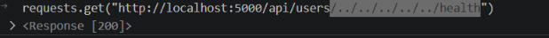

## University 
Cần truy cập biến môi trường để lấy flag. Build lab lên thấy trang login và không có register nên khả năng phải bypass cái này để login vào
```python
@app.route("/", methods=["GET", "POST"])
def login():
    if request.method == "POST":
        username = request.form["username"]
        password = request.form["password"]

        try:
            
            response = requests.get(
                f"http://localhost:5000/api/users/{username}/auth",
                timeout=3,
            )

            conn = connect_db()
            cursor = conn.cursor()
            cursor.execute("SELECT * FROM users WHERE username=?", (username,))
            user = cursor.fetchone()
            conn.close()

            if user and user[2] == password:
                session["username"] = username
                session["session_token"] = secrets.token_hex(16)
                return redirect(url_for("dashboard"))
            elif user:
                return render_template("login.html", error="Invalid password")
            elif response.status_code == 200:
                session["username"] = username
                session["session_token"] = secrets.token_hex(16)
                return redirect(url_for("dashboard"))
            else:
                return render_template("login.html", error="User not found")
        except requests.RequestException:
            return render_template("login.html",
                                   error="Error during username validation")

    return render_template("login.html")

```

Trang login ở đây thực hiện 2 cơ chế : vừa thực hiện truy vấn db và thực hiện gọi api khác để check cridential của user . Do trong db chắc chắn không có nên chỉ có thể bypass ở gọi API. Chỉ cần API trả về `200 ok` thì sẽ login thành công
```
response = requests.get(
                f"http://localhost:5000/api/users/{username}/auth",
                timeout=3,
            )
```
Thực hiện nối chuỗi trực tiếp input của user. Ở trang web này tồi tại `/health` luôn trả về `200 OK` nên `{username}` có giá trị là `/../../../../../health#` thì thư viện `request` (thực tế là `urllib3 `) sẽ tự động chuẩn hóa url nên `URL` nên thực tế sẽ là `requests.get("http://localhost:5000/health#/auth")`.



Sau khi login thì được truyền đến trang `/dashboard` ở đây có lỗ hổng SSTI --> ở đây sử dụng để đọc flag.
```python
@app.route("/add_note", methods=["POST"])
def add_note():
    if "username" in session and "session_token" in session:
        note_content = request.form["note"]
        
        note_content = (note_content
                        .replace("'", "")
                        .replace('"', "")
                        .replace("[", "")
                        .replace("]", "")
                        .replace("request", "")
                        .replace("%", ""))

        session_token = session.get("session_token")

       
        template = Template(note_content)
        rendered_note = template.render()

        conn = connect_db()
        cursor = conn.cursor()
        cursor.execute(
            "INSERT INTO notes (username, note, session_token) VALUES (?, ?, ?)",
            (session["username"], rendered_note, session_token),
        )
        conn.commit()
        conn.close()
        return redirect(url_for("dashboard"))
    return redirect(url_for("login"))

```

Ở  đây nó lọc các kí tự `' , " , [ , ] , request , %` thành rỗng.
