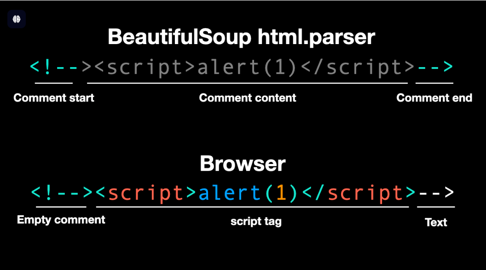
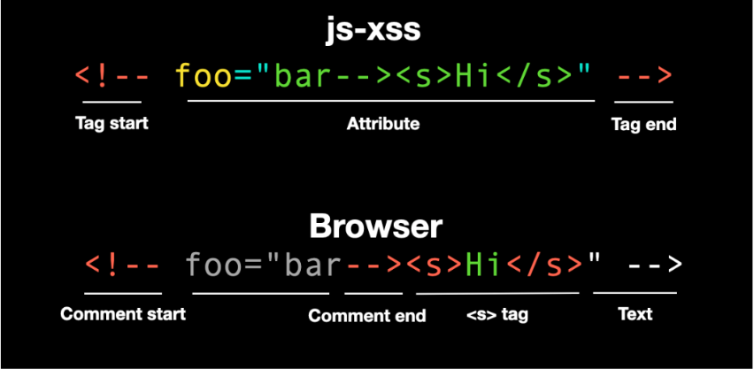
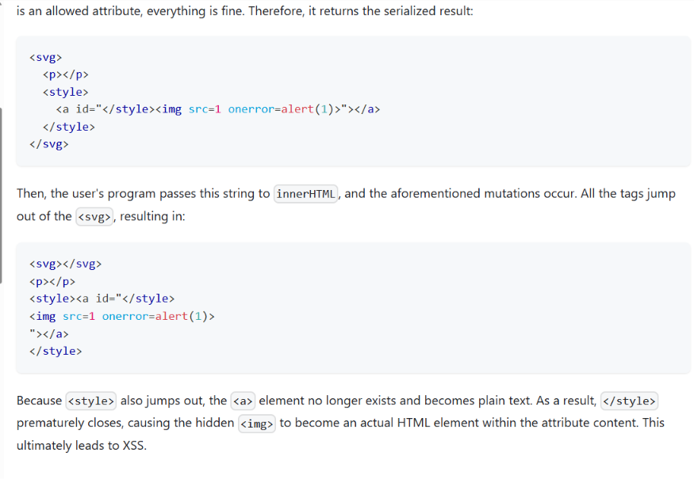

###  2. Beyond XSS [link](https://aszx87410.github.io/beyond-xss/en/)
Một chú ý trog XSS là `attribute` trong các element của html sẽ được decode tự động nếu nó bị encode.

Thẻ `<script>` ở trong `innerHTML` sẽ không được thực thi nhưng vẫn có thể bypass bằng cách chèn mã độc ở nhưng nơi khác như `src` của `iframe`.

pseudo protocol `javascript:` sẽ có quyền hạn thực thi js nó thường được dùng trong `attribute` của html elements.

Các hàm như `setTimeout()` , `setInterval()` ,... vẫn có thể thực thi js vì nó nhận vào một hàm `callback`

### Khai thác thường dựa vào sự bất động bộ trong cách xlử lý của Browser và Appliation 
#### 1.  Sử dụng thư viện parser html không có sanitization
2.1:  `BeautifulSoup` (python)

- `BeautifulSoup` và `Browser`:payload:  `<!--><script>alert(1)</script>-->`, đối với `BeautifulSoup` sẽ coi mọi thứ trong `<!--` and `-->` là comment . Còn `Browser` thì lại coi  `<!-->` là một comment rỗng.
 
    - `html.parser` (`html5lib`) là là parser mặc định của `BeautifulSoup` không tuân thủ nghiêm ngắt `HTML5` spec. Nó thấy `<!--` và hiểu rằng: "Đây là bắt đầu một comment. Comment kết thúc ở `-->`."
    - nếu `BeautifulSoup` sử dụng `lxml` thì sẽ không thành công vì `lxml` nó parser đồng bộ với `browser`


#### 2.DOMPurify
Đây là một thư viện hỗ trợ sanzation nhưng dev vẫn có thể tự config. Nếu có 1 config với mục đích `giữ lại phần commnet` như sau:
```
var filterXSSOptions = {
  allowCommentTag: true,
  whiteList: whiteList,
  escapeHtml: function (html) {
    // allow html comment in multiple lines
    return html
      .replace(/<(?!!--)/g, "&lt;")
      .replace(/-->/g, "-->")
      .replace(/>/g, "&gt;")
      .replace(/-->/g, "-->");
  },
  onIgnoreTag: function (tag, html, options) {
    // allow comment tag
    if (tag === "!--") {
      // do not filter its attributes Ở ĐÂY
      return html;
    }
  },
  // ...
};
```
có  thể bị bypass bởi: `<!-- foo="bar--><s>Hi</s>" -->` đây là `html inject`. Từ html injection có thể lên được XSS thì hên xui


#### Sửa đổi nội dung sau khi filter
https://aszx87410.github.io/beyond-xss/en/ch2/xss-defense-sanitization/#correct-library-incorrect-usage

```javascript
export const optimizeEmbed = (content: string) => {
  return content
    .replace(/\<iframe /g, '<iframe loading="lazy"')
    .replace(
      /]*?src\s*=\s*['\"]([^'\"]*?)['\"][^>]*?>/g,
      (match, src, offset) => {
        return /* html */ `
      <picture>
        <source
          type="image/webp"
          media="(min-width: 768px)"
          srcSet=${toSizedImageURL({ url: src, size: "1080w", ext: "webp" })} /* dính ở đây*/
          onerror="this.srcset='${src}'"
        />
        
      </picture>
    `;
      }
    );
};
```
Không có quote → browser sẽ parse khoảng trắng thành ranh giới attribute → kẻ tấn công có thể chèn attribute tùy ý vào URL.

Nối chuỗi thủ công thay vì escape

#### CSP - content security policy
[lý thuyết CSP](https://content-security-policy.com/)

Chú ý một số cái: `strict-dynamic` 
```html
<!DOCTYPE html>
<html>
<head>
  <meta http-equiv="Content-Security-Policy" content="script-src 'nonce-rjg103rj1298e' 'strict-dynamic'">
</head>
<body>
  <script nonce=rjg103rj1298e>
    const element = document.createElement('script')
    element.src = 'https://example.com'
    document.body.appendChild(element)
  </script>
</body>
</html>
```
Các js trong `script nonce=rjg103rj1298e` sẽ load được các js ở nguồn khác và không chịu ảnh hưởng bởi CSP.

Các `unsafe-inline` , `unsafe-eval`

[CSP Evaluator giúp đánh giá CSP](https://csp-evaluator.withgoogle.com/)

#### CSP bypass [link](https://aszx87410.github.io/beyond-xss/en/ch2/csp-bypass/)
**Bypassing via Unsafe Domains**

Trang web sử dụng `script-src` đối với một doamin không an toàn thì kẻ tấn công có thể upload js độc hại lên original rồi load vào. Các original hoạt động theo dạng tự động lấy từ npm là `unpkg.com` , `cdn.jsdelivr.net` , `cdnjs.cloudflare.com` , .....Bất kỳ `CDN công cộng` nào cho phép người dùng đóng góp mã nguồn mở lên kho gốc của nó (như npm, GitHub) và phục vụ trực tiếp dưới dạng link tĩnh đều có nguy cơ bị lợi dụng tương tự

**Bypassing via Base Element**

`base-uri` directive nó sẽ tác động đến tất cả các `relative paths` của một trang web , vì khi dùng `relative paths` nó đều phải chuyển thành `absolute path`. Nếu tràng CSP của trang web không thiết lập `base-uri 'self'` thì có thể sử dụng thẻ `<base>` để định nghĩa đường dẫn gốc.

**Bypassing via JSONP**

`` và `<script>` không bị SOP chặn ở việc tải tài nguyên cross-origin, nhưng bị SOP hạn chế ở việc đọc/trích xuất nội dung của tài nguyên đó.Đối với `` có thể load được tài nguyên nhưng không thể đọc, `<script>` có thể script từ domain khác và thực thi script đó in current page nhưng không thể đọc được soure code.

Tìm kiếm xem các allowlist domain có url nào hỗ trợ JSONP không rồi search xem cái jsonp đó khi nhận một callback nó trả về cái gì? có verify callback không?.

Nếu websites restrict the callback parameter of JSONPv ví dụ chỉ cho phép các kí tự `a-zA-Z`. Sử dụng một kĩ thuật khác gọi là [Same Origin Method Execution](https://www.someattack.com/Playground/About), ý tưởng: tìm kiếm trên curent page có đoạn code nào có thể gây XSS thì tận dụng callbak ở JSONP để thực thi nó.  In this blog post titled "[Bypass CSP Using WordPress By Abusing Same Origin Method Execution](https://pwn.ai/blog/bypass-csp-using-wordpress-by-abusing-same-origin-method-execution)" 

#### mXSS [link](https://aszx87410.github.io/beyond-xss/en/ch2/mutation-xss/#basic-flow-of-sanitizers)
Nguyên nhân chính:
  - Quy trình của Sanitizer: Nhận chuỗi $\rightarrow$ dịch thành cây DOM $\rightarrow$ lọc thành phần nguy hiểm $\rightarrow$ chuyển đổi lại thành chuỗi văn bản (serialize).
  - Tính năng "sửa lỗi" của Trình duyệt: Trình duyệt có thói quen tự động chỉnh sửa các thẻ viết sai vị trí (ví dụ: đẩy thẻ `<p>` hoặc nội dung bên trong `<svg>` nhảy ra bên ngoài). Sự thay đổi cấu trúc này chính là điểm yếu bị lợi dụng.

Một số hành vi:
  - khi `<style>` đứng một mình thì mọi thứ trong `<style></style>` đều được xem là `text`.
  - khi có thẻ `<svg>` bọc bên ngoài `<style>` thì các thẻ bên trong `<style>` sẽ được xem là phần tử HTML thực tế (có thuộc tính rõ ràng).
  - Đẩy các thẻ không hợp lệ ra khỏi `<table>` ví dụ `<h1>`
  - đẩy các thẻ không hợp lệ ra khỏi `<svg>` ví dụ thẻ `<p>`
  - Khi đặt thẻ đóng `</p>` độc lập bên trong `<svg>` mà không có thẻ mở tương ứng.Tự động thêm thẻ mở khi gặp thẻ đóng thừa (`</p>`)



#### Prototype Pollution

Trong js tồn tại một thuộc tính ẩn `__proto__` là cái sẽ lưu trữ các giá trị mà js engine sẽ tìm kiếm thường được gọi là truy cập lên `prototype` của đối tượng cha.

Prototype Pollution thường xảy ra ở 2 kịch bản:
- **1. chuỗi query**: Các thư viện hỗ trợ array or các object lồng nhau như: `?a=1&a=2` or `?a[]=1&a[]=2` , `?a[b][c]=1`
  - Ví dụ code parse 1 đối tượng thành object: thư viện [qs](https://github.com/ljharb/qs#parsing-objects)
```javascript
function parseQs(qs) {
  let result = {};
  let arr = qs.split("&");
  for (let item of arr) {
    let [key, value] = item.split("=");
    if (!key.endsWith("]")) {
      // for a normal key-value pair
      result[key] = value;
      continue;
    }

    // for object
    let items = key.split("[");
    let obj = result;
    for (let i = 0; i < items.length; i++) {
      let objKey = items[i].replace(/]$/g, "");
      if (i === items.length - 1) {
        obj[objKey] = value;
      } else {
        if (typeof obj[objKey] !== "object") {
          obj[objKey] = {};
        }
        obj = obj[objKey]; // ở đây
      }
    }
  }
  return result;
}

var qs = parseQs("test=1&a[b][c]=2");
console.log(qs);
// { test: '1', a: { b: { c: '2' } } }
```

Cấu trúc một object dựa vào nội dung bên trong `[]`. Nếu parse `__proto__[a]=3`
```javascript
var qs = parseQs("__proto__[a]=3");
console.log(qs); // {}

var obj = {};
console.log(obj.a); // 3
```
  - một số thư viện gặp case tương tự:
    - [jquery-deparam](https://snyk.io/vuln/SNYK-JS-JQUERYDEPARAM-1255651)
    - [backbone-query-parameters](https://snyk.io/vuln/SNYK-JS-JQUERYDEPARAM-1255651)
    - [jquery-query-object](https://snyk.io/vuln/SNYK-JS-JQUERYQUERYOBJECT-1255650)


- **2. gộp các object**
  - thường xảy ra ở các tính năng như cấu hình hệ thống , tùy chỉnh theme vì từ một `defaultConfig` sẽ kết hợp với `customConfig` để ghi đè một số thông tin muốn thay đổi lên `defaultConfig`.

```javascript
  function merge(a, b) {
  for (let prop in b) {
    if (typeof a[prop] === "object") {
      merge(a[prop], b[prop]);
    } else {
      a[prop] = b[prop];
    }
  }
}

var config = {
  a: 1,
  b: {
    c: 2,
  },
};

var customConfig = {
  b: {
    d: 3,
  },
};

merge(config, customConfig);
console.log(config);
// { a: 1, b: { c: 2, d: 3 } }
```


#### DOM-clobbering
yêu cầu: cần có html injection. DOM Clobbering chỉ có thể khai thác khi dev không khởi tạo biến or tin tưởng dữ liệu bên ngoài (Code giả định rằng biến đó chắc chắn sẽ tồn tại hoặc là một object an toàn)

Khi định nghĩa một element html bằng `id` chúng ta có thể truy cập nó thông qua javascript
```javascript
<button id="btn">click me</button>
<script>
  console.log(window.btn) // <button id="btn">click me</button>
</script>
```
giá trị `id` đã được tạo mở html sẽ được gán vào biến toàn cục `window` nên bất kì đâu cũng có thể gọi nó ra .Bất kỳ thuộc tính hoặc biến nào nằm trên `window` đều có thể được gọi trực tiếp bằng tên mà không cần phải gõ tiền tố `window` ở đằng trước.

Đối với các html element sau:  `<embed>`, `<form>`, ``, and `<object>` có một attribute `name` thì có thể truy cập trực tiếp các element đó thông qua `window`. Vì nó được gán vào `window` nên có thể gọi trực tiếp nó thông qua  tên mà không cần prefix `window`.

Các html elements khi được nối chuỗi sẽ tự động gọi `toString` và trả về một format nhất định nhưng đối với thẻ `<a>` , `<base>` sẽ trả về giá trị của  `href` attribute.

Các lý thuyết trên không thể overwrite các biến đã được khai báo bởi js
```javascript
<!DOCTYPE html>
<html>
<head>
  <script>
    TEST_MODE = 1
  </script>
</head>
<body>
  <div id="TEST_MODE"></div> 
  <script>
    console.log(window.TEST_MODE) // 1
  </script>
</body>
</html>
```

Trong html có tính chất kế thừa trong thẻ `form`. Từ đây có thể tạo phân cấp
```html
<!DOCTYPE html>
<html>
<body>
  <form id="config">
    <input name="isTest" />
    <button id="isProd"></button>
  </form>
  <script>
    console.log(config) // <form id="config">
    console.log(config.isTest) // <input name="isTest" />
    console.log(config.isProd) // <button id="isProd"></button>
  </script>
</body>
</html>
```
Cũng có thể tận dụng thuộc tính `value` của `<input>` để ghi đè
```html
<!DOCTYPE html>
<html>
<body>
  <form id="config">
    <input name="enviroment" value="test" />
  </form>
  <script>
    console.log(config.enviroment.value) // test
  </script>
</body>
</html>
```
You can generate an HTMLCollection using the same `id`, and then use the `name` attribute to retrieve a specific element from the HTMLCollection, achieving a two-level effect.

ngoài `window` thì `document` cũng sẽ ảnh hưởng 
```html
<!DOCTYPE html>

<html lang="en">
<head>
  <meta charset="utf-8">
</head>
<body>
  
  <form id=test>
    <input name=lastElementChild>
    <div>I am last child</div>
  </form>
  <embed name=getElementById></embed>
  <script>
    console.log(document.cookie) // 
    console.log(document.querySelector('#test').lastElementChild) // <input name=lastElementChild>
    console.log(document.getElementById) // <embed name=getElementById></embed>
  </script>
</body>
</html>
```

#### MIME Sniffing
Nếu response không set `Content-Type` thì chúng ta có thể controll content để trình duyệt xử lý nó như `html/text` bằng cách sử dụng ` MIME sniffing `.

Đối với chome:
  - Trình duyệt chỉ kiểm tra tối đa 512 byte ở phần đầu của nội dung phản hồi (TruncateStringPiece).
  - Danh sách các thẻ được nhận diện: `<!DOCTYPE html>` hoặc chỉ thị XML `<?xml` , `script`, `html`, `!--` (chú thích), `head`, `iframe`, `h1`, `div`, `font`, `table`, `a`, `style`, `title`, `b`, `body`, `br`, `p`.
  - nó lọc khoảng trắng rồi nhận diện các thẻ trên để xác định `html/text`.

Nhưng thực tế các websever hiện này khi trả response thì đều set `content-type` nhưng ở `Apache` HTTP Server có một hành vi sau: "if the filename contains only a dot   , it will not output the Content-Type. For example, `a.png` will automatically detect the MIME type based on the file extension and output `image/png`, but if the filename is ``..png``, it will not output the `Content-Type`."


Đối với đoạn code sau: `<script src="URL"></script>` chỉ có thể thực thi js nếu `URL` trả về các `content-type` sau: `application/zip` , `application/json` , `application/octet-stream` , `text/html` , `text/json` , `text/plain` , `huli/blog` , `font/woff2`. 


#### XSLeaks
Thực hiện Side-channel attacks  so với cách hành vi khác nhau của page để leak sensitive information
Một số dạng đã gặp:
- Khai thác oracles dựa trên độ dài iframe
- 
