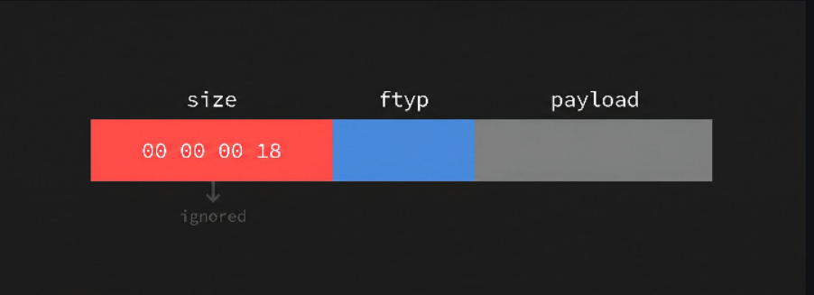
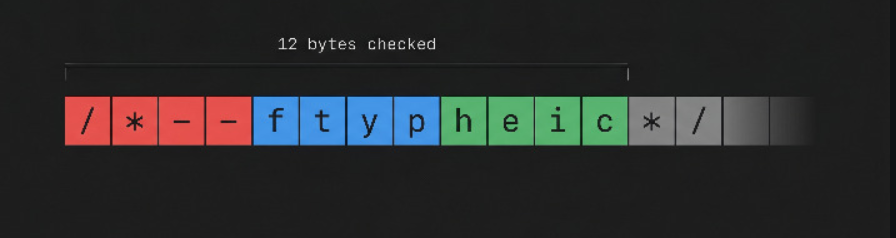

## Một số chú ý
Một số thư viện gửi request có thể sẽ tự đọng chuẩn hóa url dẫn đến việc gửi request đến target không như mong muôn.

ví dụ: thư viện `urllib3`
```python
  response = requests.get(
                f"http://localhost:5000/api/users/{username}/auth",
                timeout=3,
            )
# nếu url dạng http://quandz/../../../.../chuan thì url sẽ thành http://chuan
```

Ở SQL nếu khởi tạo db mà sử dụng `char(n)` thì đây là dạng `fixed-length` nên dữ liệu trong db sẽ được tự động thêm , bớt để đủ độ dài `n`. Ở đây có thể dẫn đến `take account` thông qua đăng kí . Điều kiện kiên quyết là `STRICT mode` bị tắt nhưng default ở `MySQL 5.7+` nó được bật

Ví dụ:
```
bảng user có username và password khởi tạo type là char(20) và tồn tại một bản ghi admin
Đăng kí 1 tài khoản "admin" + 15_space +"vài kí tự"  thì khi so sánh sẽ trả vê false ==> không trùng bản ghi ==> đăng kí thành công.
Nhưng thực tế ở DB thì sẽ tự động bị cắt và sẽ tồn tại bản ghi `admin` với password đã được chúng ta đăng kí. 
```

`proxy_cache_use_stale error timeout updating;`Khi backend gặp sự cố (error, timeout) hoặc đang được cập nhật (updating), Nginx sẽ phục vụ cache CŨ (stale) thay vì trả lỗi cho client. 

LỖ HỔNG `Web Cache Deception ` thường dính ở quy tắc cache dựa trên phần mở rộng của `file tĩnh`.

Điểm yếu trong lập trình: Không dùng một hàm `sign` với một `key` nhất định cho nhiều mục đích khác vì có thể dẫn đến `forged signature`. 

Kiểm thử nếu thấy các API dạng `v2` hay version lớn hơn thì có thể sẽ tồn tại các version cũ hơn như `v1` ở các version cũ có thể dính lỗ hổng như không được cung cấp cơ chế xác thực hay thiếu kiểm tra quyền . Cần xác định thì tối thiểu nhất thì vẫn sẽ thấy các endpoint này vẫn còn hoạt động. 

## 1. lỗi tự động ép kiểu (SQL type coercion)
### 1.1 MySQL/MariaDB
Implicit Type Conversion (hay Type Coercion) là cơ chế MySQL/MariaDB tự động chuyển đổi kiểu dữ liệu của các giá trị khi thực hiện một phép toán hoặc phép so sánh giữa các kiểu dữ liệu khác nhau.
Điều này có nghĩa là developer không nhất thiết phải viết phép ép kiểu một cách rõ ràng. Database có thể tự quyết định cách chuyển đổi kiểu để thực hiện phép so sánh.

`note`: có xu hướng chuyển từ chuỗi sang số
Ví dụ:

SELECT '123' = 123;

Trong một số ngữ cảnh, MySQL/MariaDB sẽ chuyển đổi một trong hai toán hạng để đưa chúng về kiểu phù hợp trước khi so sánh.

**String và Number**
- Một trường hợp quan trọng về mặt Security là so sánh:`STRING ↔ NUMBER`
- ví dụ:
    - giá trị số được lấy từ phần số ở đầu chuỗi: `'123abc' → 123`
    - Đối với một chuỗi không bắt đầu bằng số: `'fakepasswd' → 0`
    - Do đó cần đặc biệt chú ý khi so sánh dữ liệu `VARCHAR` với một giá trị số.

**`TRUE` và `FALSE`**
- Trong MySQL/MariaDB:`TRUE  ≈ 1` và `FALSE ≈ 0`
    - Do đó: `WHERE password = TRUE` về bản chất đang đưa một giá trị số 1 vào phép so sánh.

**Một số chức năng thường được khai thác:**
    - Xử lý mật khẩu

## 2. inconsistency between the application and database
### 2.1 : MySQL/MariaDB [chi tiết](https://blog.voorivex.team/usual-suspect-type-confusion-in-twelve-bytes)

**Khái niệm:**
- CHARACTER SET: Định nghia các kí tự sẽ được db lữu trữ
- COLLATE: Xác định làm sao dữ liệu được lưu trữ và so sánh 
- CHARACTER SET và COLLATE : mặc định của mysql/mariaDb nếu lúc tạo table không chỉ đĩnh rõ là `utf8mb4`

**Reason:**
- Nếu tạo bảng mà không chỉ rõ collate cụ thể thì sẽ áp dụng collate mặc định 
- không kiểm tra chuỗi giống nhau theo từng byte/code mà lại kiểm tra theo "weight" nhưng ở tầng ứng dụng lại kiểm tra theo từng byte/code

Mã nguồn để fuzzing các kí tự được xử so sánh giống nhau cho kí tự 'a':
```
import mysql.connector

conn = mysql.connector.connect(
    host="localhost",
    user="test",
    password="test",
    database="test"
)

cursor = conn.cursor()

for i in range(0, 0x10ffff + 1):
    char = chr(i)

    cursor.execute("SELECT %s = 'a' AS is_equal", (char,))
    result = cursor.fetchone()

    if result[0]:
        print(f"Unicode Character {i} ({char}) is equal to 'a' in MySQL")

cursor.close()
conn.close()
```

(trong wordpress cũng sẽ so sanshd dạng này)
**Một số chức năng có thể khai thác:**
- Forgot Password Section
- OAuth Provider Email Trust
- OAuth Provider Redirect URL

**Forgot Password Section**
- Nhập email của victim rồi intercept the HTTP request rồi thay bằng email của kẻ tấn công controll (puny-coded version) và link reset password sẽ được emailed to the puny-coded email, which is under your control.
- email được gửi link reset phải lấy từ người dùng còn lấy từ db thì chịu

**OAuth Provider Email Trust**

Quy trình:
1. Yêu cầu đăng nhập (Login with X):
2. Chuyển hướng xác thực (Redirect to Provider):
3. Cấp mã ủy quyền (Code + Redirect):
- Sau khi đăng nhập thành công ở phía Provider, Provider sinh ra một mã ủy quyền tạm thời (`code`) và chuyển hướng trình duyệt của kẻ tấn công quay trở lại Web App thông qua `URL callback` kèm theo mã này.
4. Gửi mã xác thực về Web App (Code):
- Trình duyệt của kẻ tấn công gửi mã ủy quyền (`code`) đó ngược lại cho máy chủ của Web App.
5. Trao đổi Token và lấy thông tin người dùng (API Call):
- Web App dùng mã ủy quyền (`code`) để gọi trực tiếp tới API của Provider nhằm đổi lấy mã truy cập (`Access Token`), từ đó lấy thông tin hồ sơ của người dùng (bao gồm địa chỉ email, ví dụ: user@gmàil.com).
6. Truy vấn cơ sở dữ liệu (Database Query):
Web App nhận email từ Provider và thực hiện câu lệnh truy vấn tìm kiếm email đó trong cơ sở dữ liệu (ví dụ: MySQL) để xem người dùng đã tồn tại hay chưa nhằm tiến hành tạo phiên đăng nhập (session).


Vấn đề:
  - xảy ở bước truy vấn database. để tìm email trong MySQL, nếu bảng dữ liệu sử dụng các quy luật so sánh (collation) không phân biệt dấu hoặc không phân biệt bảng mã (ví dụ: `utf8mb4_unicode_ci` hay `utf8mb4_general_ci`), cơ sở dữ liệu sẽ tự động coi ký tự dị biệt (`à`) giống như ký tự thông thường (`a`).
  - Hậu quả (Account Takeover): Kết quả là câu lệnh truy vấn trả về bản ghi (record) tài khoản chính chủ của nạn nhân (`user@gmail.com`). Web App lầm tưởng kẻ tấn công chính là chủ nhân thực sự của tài khoản và cấp quyền đăng nhập thẳng vào phiên làm việc của nạn nhân.  


## 2. bất đồng bộ parser giữa trình duyệt và BE [chi tiết](https://blog.voorivex.team/when-two-parsers-disagree-exploiting-query-string-differentials-for-xss)

thư viện `qs` (`extended: true`)của express cấu hình sẵn trong `req.query` và `body-parser`

cấu hình `extended:True` thì from the `basic built-in parser` to a library called `qs`
    - **depth: 5** (maximum nesting level)
    - **arrayLimit: 20** (maximum array index)
    - **delimiter: '&'** (what separates parameters)
    - **parametersLimit**: 1000 (maximum number of parameters to parse)
    - **allowPrototypes**: true (the only non-default)


- **cách hoạt động**
    - khi các key giống nhau thì sau khi parse sẽ trở thành một `array` :`quan=1&quan=2&[quan]=3` được parse thành : `quan["1","2","3"]`
    - cặp key nếu bọc trong cặp `[]` thì cặp `[]` sẽ được loại bỏ : Ví dụ `[quan]=dz` tương đương với `quan=dz`
    - khi có `extended:True` thì `qs`sẽ hỗ trợ đối tượng lồng là `value` sẽ được lấy ngay sau dấu `=` của `]`
        - `GET /?user[name]=quan&user[age]=21`
        - express cấu hình: `app.set('query parser', 'extended');`
        - `qs` sẽ parse thành:
            
            ```jsx
            req.query = {
              user: {
                name: "quan",
                age: "21"
              }
            }
            ```
            
    - khi có một chain key : `GET /?a[b][c]=1`
        
        
        ```jsx
        {
          a: {
            b: {
              c: "1"
            }
          }
        }
        ```

**Thứ tự cần nhớ:**

```jsx
Raw query string
      ↓
1. split bằng &
      ↓
2. tìm vị trí "=" để tách key/value   **ưu tiên dấu = sau ] trước**
      ↓
3. parse key thành chain               
      ↓
4. tạo nested object
      ↓
5. merge
```

**Trinh duyệt parse:**

- `URLSearchParams` dùng để đọc query string
    - bỏ kí tự `?`  để lấy query string  , sau đó lại tách bằng `&`  ở mỗđâi phần lại tách ở dấu `=` đầu tiên để chia thành cặp **`key:value`**
    - trinh duyệt không hiểu query lồng nhau
    - ví dụ:
        - `?name=quan=admin&name=hacker&age=21&[user]=test` sau khi qua `URLSearchParams` thành
            
            ```jsx
            name : quan=admin
            name : hacker
            age : 21
            [user] : test
            ```
            
        - khi `URLSearchParams.get("name")` thì luôn trả về `key:value` đầu tiên

**`VÍ DỤ CTF:`**

```bash
const express = require('express');
const app = express();

app.set('query parser', 'extended');

app.get('/', (req, res) => {
  const redirectUri = req.query.redirect_uri;

  if (!redirectUri) {
    return res.send("redirect_uri is required");
  }

  if (redirectUri !== "https://pwnbox.xyz/docs") {
    return res.send("Invalid redirect_uri");
  }

  return res.send(`
    <script>
      location = new URLSearchParams(window.location.search).get("redirect_uri");
    </script>
  `);
});

app.listen(3000, () => console.log('Listening on port 3000'));
```

**solution:**

Cách 1: Làm cho BE và trình duyệt thấy 2 cái khác nhau

- `?[redirect_uri]=https://pwnbox.xyz/docs&----------chèn thêm 1000 tham số rác -------- &redirect_uri=javascript:alert(origin)`

Cách 2:

`/?redirect_uri=javascript:alert(origin)//x]=x&redirect_uri=https://pwnbox.xyz/docs`

## Một số hàm trong javascript

ví dụ:

```jsx
  export async function  doRequest() (
    key: string,
    id: number,
    path: string,
  ): Promise<string> {
    const api = await prisma.api.findFirst({ where: { id } })
    if (!api) return 'Invalid API'
    if (api?.key !== key) return 'Invalid API key'
    if (path.length > 10) return 'Path too long'
    if ([...'!@#$%^&*()-_=+[{]};:\'",<.>/?\\|'].some((c) => path.includes(c)))
      return 'Forbidden character'

    const { stdout } = await exec(`curl http://${api.host}/api/${path}`, {
      timeout: 1000,
    })

    if (stdout) return readStream(stdout)
    return 'Error'
  }
```

`Object.length` : 

- Nếu Object là một chuỗi `string` là trả về  **số lượng ký tự UTF-16 code units** trong chuỗi.
- Nếu Object là một mảng `array`  trả về số lượng các phần tử trong mảng

`Object.include(pattern)` :  

- Nếu Object là một chuỗi `string` nếu tồn tại pattern trong chuỗi thì trả về `True`
- Nếu Object là một mảng `array`  thì nếu pattern là một phần tử trong mảng thì mới trả về `True`

Nếu vậy ở code bộ lọc trên để bypass thì có thể sử dụng một mảng thay vì một chuỗi

##  LINUX

Trong linux có tồn tại một số thư mục đặc biệt sau:

- `/proc`  file ảo lưu tiến trình hệ thống
- `/proc/self/environ` or `/proc/self/fd/N`  với N là PID của tiến trình (0 - 50)  nó thường sẽ lưu giá trị của `User-Agent` header của một HTTP request
- ký tự **`x`** tại trường mật khẩu của người dùng có ý nghĩa đặc biệt:
    - Nó báo cho hệ thống biết rằng **mật khẩu thực sự đã được mã hóa (hash) và được lưu bảo mật nằm bên trong tệp `/etc/shadow`**, chứ không nằm ở tệp **`/etc/passwd`**.
    - khi xóa kí tự x ở file **`/etc/passwd`** thì nó ám chỉ password này không được mã hóa (vô hiệu hóa mật khẩu thực sự trong **`/etc/shadow`**)


## 1. Giải Mã Tệp Polyglot [chi tiết](https://blog.voorivex.team/usual-suspect-type-confusion-in-twelve-bytes)

What are polyglots? [chi tiết](https://medium.com/swlh/polyglot-files-a-hackers-best-friend-850bf812dd8a)
- Polyglots, in a security context, are files that are a valid form of multiple different file types.For example, a GIFAR is both a GIF and a RAR file. There are also files out there that can be both GIF and JS, both PPT and JS, etc.
- Polyglot files are often used to bypass protection based on file types. Many applications that allow users to upload files only allow uploads of certain types, such as JPEG, GIF, DOC, so as to prevent users from uploading potentially dangerous files like JS files, PHP files or Phar files.

what is ISO Base Media File Format?
- Là một standard format cho các file phương tiện (media) như MP4, MOV, HEIC, AVIF, … Định dạng của nó có thể hiểu là các box tuần tự: Every box begins with a 4-byte size, a 4-byte type, and then its payload:


thư viện file-type of node version 16.5.4
```
// File Type Box (ISO base media file format)
if (
    checkString('ftyp', {offset: 4}) &&// kiểm tra từ byte thứ 4 , check type of box
    (buffer[8] & 0x60) !== 0x00 // Brand major, first character ASCII?
) {
    const brandMajor = buffer.toString('binary', 8, 12).replace('\0', ' ').trim();
    switch (brandMajor) {
        case 'avif':              return {ext: 'avif', mime: 'image/avif'};
        case 'mif1':              return {ext: 'heic', mime: 'image/heif'};
        case 'heic': case 'heix': return {ext: 'heic', mime: 'image/heic'};
        // ...
    }
}
```
đoạn code trên bỏ qua hoàn toàn các byte 0->3 . Box size hoàn toàn bị bỏ qua


Ý tưởng:
- chèn kí tự commnet vào phần size box và payload box. Đặc biệt nguy hiểm khi xả ra case phía BE sử dụng kiểm tra loại file sơ sài (Shallow Sniffing) nhưng khi trả ngược lại về người dùng thì lại set content-type dựa vào extension. 

### ý nghĩa:
- type file không phải là tĩnh mà nó được định nghĩa
- Các thư viện quét nhanh như file-type ra đời để tối ưu hiệu năng (chỉ đọc vài byte đầu để đoán định dạng), hoàn toàn không phải là bộ phân tích cấu trúc tệp (parser) chuyên sâu. Dùng chúng như lớp phòng thủ cốt lõi để quyết định tệp có an toàn hay không là một sai lầm chết người.


## 3. Một sô chú ý khi có thể chưa biết
### 1. Một số request header có thể được sử dụng ở trong middleware
- `Sec-Fetch-Site`: Xuất hiện trong hầu như mọi HTTP request mà trình duyệt hiện đại gửi đi (bao gồm tải ảnh, file script, css, iframe, lệnh fetch(), XMLHttpRequest, chuyển trang, form submit,...).
- `Sec-Fetch-User: ?1`
    - Request là một hành vi điều hướng toàn trang:
        - Tức là request đó làm tải lại hoặc chuyển toàn bộ trang web sang URL mới (như bấm vào thẻ `<a>`, submit `<form>`, hoặc redirect trang).
        - Các request chạy ngầm trong nền như `fetch()`, `XMLHttpRequest`, tải ảnh qua ``, tải script qua `<script>` **không bao giờ có header này**.
    - Phải có sự tương tác chủ động của người dùng thật (User Activation).
        - Người dùng phải trực tiếp dùng tay click chuột, chạm màn hình cảm ứng, hoặc bấm phím để kích hoạt hành động đó.
        - Nếu một hành vi chuyển trang do mã JavaScript tự ý gọi (ví dụ: `window.location.href = '...'` hoặc `document.forms[0].submit()` chạy ngầm mà không gắn liền với một sự kiện click của người dùng), trình duyệt sẽ không đính kèm header này (hoặc giá trị Sec-Fetch-User sẽ bị bỏ qua/undefined). Khi có tương tác người dùng hợp lệ, giá trị của nó luôn là ?1.

Check việc framework có chuẩn hóa đường dẫn không trong các `case-insensitive` , `case-sensitive` , `aaa/`  , `axxx` 
