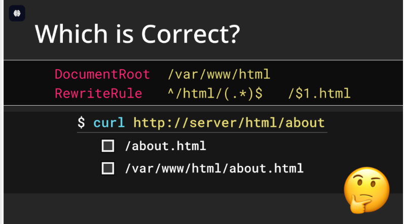
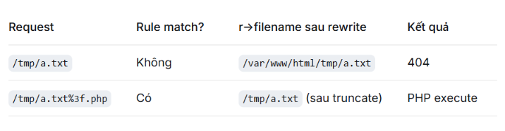

**NOTE: Apache HTTP Server từ 2.4.59 trở xuống , bản vá xuất hiện ở 7 năm 2024**

## reference
https://blog.orange.tw/posts/2024-08-confusion-attacks-en/

https://i.blackhat.com/BH-US-24/Presentations/US24-Orange-Confusion-Attacks-Exploiting-Hidden-Semantic-Thursday.pdf

## Phân tích
### Filename Confusion

`r->filename `should represent a filesystem path. However, in Apache HTTP Server, some modules treat it as a URL. If, within an HTTP context, most modules consider `r->filename` as a filesystem path but some others treat it as a URL, this inconsistency can lead to security issues!.

Module xử lý `r->filename` như là một `URL` :

**mod_rewrite**

**RewriteRule**

Syntax: `RewriteRule Pattern Substitution [flags]`. Vì `Substitution` cũng được xử lý như một `URL` nên nó vẫn sẽ bị Server cắt bởi kí tự `?` hay là decode url ,... để lấy path thật.

Ví dụ:
```apacheconf
RewriteEngine On
RewriteRule "^/user/(.+)$" "/var/user/$1/profile.yml"

========================================================

$ curl http://server/user/orange
 # the output of file `/var/user/orange/profile.yml`

$ curl http://server/user/orange%2Fsecret.yml%3F
 # the output of file `/var/user/orange/secret.yml`


```

#### Lỗi gán flag

Syntax: `RewriteRule Pattern Substitution [flags]`

```apacheconf
RewriteEngine On
RewriteRule  ^(.+\.php)$  $1  [H=application/x-httpd-php]

```

Ở cấu hình trên thì được hiểu như sau: Nếu request có URL kết thúc bằng `.php` extension thì nó sẽ thêm handler tương ứng `application/x-httpd-php` để xử lý request này, `$1` nghĩa là `backreference` nó sẽ Lấy chính xác phần nội dung mà biểu thức chính quy (Regex) ở phần Pattern đã capturing group trong dấu ngoặc tròn (...) để nhét vào vị trí đó.. Theo như phân tích ở phần **Filename Confusion** thì thì `Substitution` vẫn là một url-path nên sẽ bị cắt bớt bởi kí tự `?`

attack process:

1. upload malicious file (nội dung là php) không quan tâm extension

2. truy cập nó `/path/to/malicious_file.extension%3Fhehe.php` các phần `hehe.php` để match với `RewriteRule` còn Substitution sẽ trở thành `/path/to/malicious_file.extension`.

#### ACL Bypass 


all authentications or access controls based on the `Files` directive for a `single PHP file` are at risk when running together with `PHP-FPM` bị bypass chỉ bởi `?` 

Filename Confusion xảy ra trong `mod_proxy`. This time the authentication and access control bypass is caused by the inconsistent semantic of r->filename among the modules!.

`mod_proxy` xử lý `r->filename` như là một URL trong khi các module khác thường xử lý trường này là filesystem path. Nếu Kiểm soát truy cập `file-based`  xử lý `r->filename` như là filesystem path.

Một cấu hình kiếm soát truy cập phổ biến:
```apacheconf
<Files "admin.php">
    AuthType Basic # Basic Authentication
    AuthName "Admin Panel" # banner
    AuthUserFile "/etc/apache2/.htpasswd" # file chứa credential do quản trị viên tự tạo thủ công bằng công cụ htpasswd của Apache
    Require valid-user # yêu cầu người dùng hợp lệ
</Files>
```
Khi người dùng truy cập url: `http://server/admin.php%3Fooo.php` authentication module so sánh với file `admin.php` không match lúc này `r->filename` là `admin.php?ooo.php` do đó request này không yêu cầu xác thực. Nhưng đối với `PHP-FPM` configuration nó chuyển tiếp requets kết thúc bằng `.php` đến `mod_proxy` using the `SetHandler `directive:
```apacheconf
# Using (?:pattern) instead of (pattern) is a small optimization that
# avoid capturing the matching pattern (as $1) which isn't used here
<FilesMatch ".+\.ph(?:ar|p|tml)$">
    SetHandler "proxy:unix:/run/php/php8.2-fpm.sock|fcgi://localhost"
</FilesMatch>

```
The `mod_proxy` will rewrite `r->filename` to the following URL and call the sub-module `mod_proxy_fcgi` to handle the subsequent `FastCGI` protocol:`proxy:fcgi://127.0.0.1:9000/var/www/html/admin.php?ooo.php`
```c
#define APACHE_PROXY_FCGI_PREFIX "proxy:fcgi://"
#define APACHE_PROXY_BALANCER_PREFIX "proxy:balancer://"

if (env_script_filename &&
    strncasecmp(env_script_filename, APACHE_PROXY_FCGI_PREFIX, sizeof(APACHE_PROXY_FCGI_PREFIX) - 1) == 0) {
    /* advance to first character of hostname */
    char *p = env_script_filename + (sizeof(APACHE_PROXY_FCGI_PREFIX) - 1);
    while (*p != '\0' && *p != '/') {
        p++;    /* move past hostname and port */
    }
    if (*p != '\0') {
        /* Copy path portion in place to avoid memory leak.  Note
         * that this also affects what script_path_translated points
         * to. */
        memmove(env_script_filename, p, strlen(p) + 1);
        apache_was_here = 1;
    }
    /* ignore query string if sent by Apache (RewriteRule) */
    p = strchr(env_script_filename, '?');
    if (p) {
        *p =0;
    }
}


```
Theo như code trên thì sẽ chuẩn hóa`proxy:fcgi://127.0.0.1:9000/var/www/html/admin.php?ooo.php` thành file path for execution là `/var/www/html/admin.php`. Cái này dẫn đến việc bypass ACL cấy hình ở `File`  directive.

### DocumentRoot Confusion


The answer is — it accesses both paths. Yep, that’s our second Confusion Attack. For any[1] RewriteRule, Apache HTTP Server always tries to open both the path with DocumentRoot and without it! Amazing, right? 😉
```c
    if(!(conf->options & OPTION_LEGACY_PREFIX_DOCROOT)) {
        uri_reduced = apr_table_get(r->notes, "mod_rewrite_uri_reduced");
    }

    if (!prefix_stat(r->filename, r->pool) || uri_reduced != NULL) {     // <------ [1] access without root
        int res;
        char *tmp = r->uri;

        r->uri = r->filename;
        res = ap_core_translate(r);             // <------ [2] access with root
        r->uri = tmp;

        if (res != OK) {
            rewritelog((r, 1, NULL, "prefixing with document_root of %s"
                        " FAILED", r->filename));

            return res;
        }

        rewritelog((r, 2, NULL, "prefixed with document_root to %s",
                    r->filename));
    }

    rewritelog((r, 1, NULL, "go-ahead with %s [OK]", r->filename));
    return OK;
}


```
Ở đoạn code trên thì nếu `absolute path` thì nó sẽ ghép nối với `DocumentRoot` \

Ví dụ:
cấu hình:
```apacheconf
RewriteEngine On
RewriteRule  ^(.+\.php)$  $1  [H=application/x-httpd-php]

```
Trên os sẽ tồn tại file `/tmp/a.txt`

request 1: `/tmp/a.txt` trả về 404

request 2: `/tmp/a.txt%3f.php` trả về thực thi mã php




Yêu cầu: Cấu hình không an toàn
```apacheconf
RewriteEngine On
RewriteRule  "^/html/(.*)$"  "/$1.html" #  cái cuối  "/$1.html"  mới quan trọng
```
#### Server-Side Source Code Disclosure
`curl http://server/html/Absolute_Path_to_File%3F`

#### Local Gadget to Information Disclosure
####  Local Gadget to XSS
#### Local Gadget to LFI
#### Local Gadget to RCE

### Handler Confusion
```apacheconf
AddHandler handler-name extension [extension] ...
AddType media-type extension [extension] ...
```

```
AddHandler application/x-httpd-php .php
→ set r->handler.

AddType application/x-httpd-php .php
→ set r->content_type, không set r->handler.
```

#### Overwrite the Handler
Apache HTTP Server uses AddType to run PHP.`AddType application/x-httpd-php  .php`
