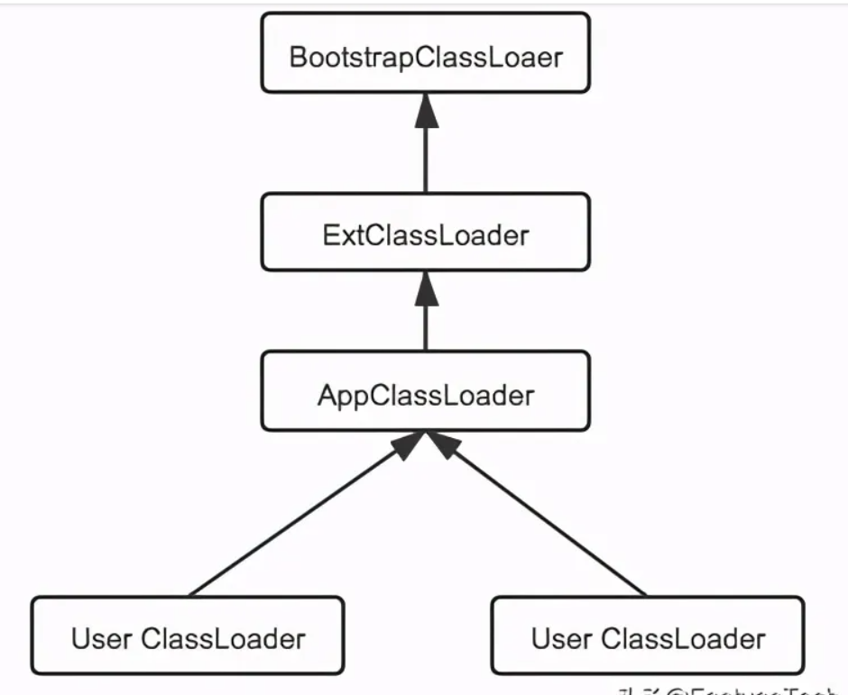

Chuỗi serialize ở java sau khi decode base64  sẽ có các byte đặc trưng sau : `ac` `ed` `00` `05`


## 1. ClassLoader [chi tiết](https://developer.aliyun.com/article/859819)
Java không phải là một an executable file, nó là tập hợp nhiều Java classes , nó được kiểm soát bởi JVM. ClassLoader đảm nhận việc đọc các tệp `.class`

Cơ chế runtime của `ClassLoader`: 
Java provides three ClassLoaders: `BootStrapClassLoader`, `ExtClassLoader`, and `AppClassLoader`. Trong đó `AppClassLoader` class loader mặc định nếu chúng ta không chỉ định class loader.
- BootStrapClassLoader:
    - Bộ nạp các lớp khởi động (startup class loader) chủ yếu load các class trong thư mục `lib` của JRE, được viết bằng C++.Đây là class loader built-in trong JVM cho việc việc load các thư viện chính. 
    - Java programs can use the following code to see which jar packages this class loader has loaded:
    ```java
    URL[] urls=sun.misc.Launcher.getBootstrapClassPath().getURLs();
     for (int i = 0; i < urls.length; i++) {
       System.out.println(urls[i].toExternalform());
     }

    /// ourput 
    file:/C:/Program%20Files%20(x86)/Java/jre7/lib/resources.jar
  file:/C:/Program%20Files%20(x86)/Java/jre7/lib/rt.jar
  file:/C:/Program%20Files%20(x86)/Java/jre7/lib/sunrsasign.jar
  file:/C:/Program%20Files%20(x86)/Java/jre7/lib/jsse.jar
  file:/C:/Program%20Files%20(x86)/Java/jre7/lib/jce.jar
  file:/C:/Program%20Files%20(x86)/Java/jre7/lib/charsets.jar
  file:/C:/Program%20Files%20(x86)/Java/jre7/lib/jfr.jar
  file:/C:/Program%20Files%20(x86)/Java/jre7/classes 
    ```
- ExtClassLoader:
    - Load các classs trong thư mục `$JAVA_HOME/jre/lib/ext` or bất kì class nào được chỉ định bởi `java.ext.dirs` system property. Khi có một public custom class muốn được tự động load thông qua `ExtClassLoader` thì có thể làm như sau:
        - java -Djava.ext.dirs = /home/externalDir
        - Place the extra jar package in the jre/lib/ext directory

- AppClassLoader:
    - Load all Java classes in the directory specified by `java.class.path` (usually mapped to system classPath), implementing the `sun.misc.Launcher$AppClassLoader` interface. When executing a program, you can specify the system classpath via -classpath, -cp, or -Djava.class.path.

**Java ClassLoader parental delegation mechanism**
- Vì java có nhiều class loader trong cùng một lúc nên khi một ClassLoader nhận yêu cầu nạp một class, nó sẽ ủy quyền cho class loader cha , nếu các class loader cha không tìm hay load được class thì class loader gốc(class loader nhận request lúc đầu) mới thực hiện việc load class.

- Các method quan trọng của `ClassLoader` class:
    - loadClass : Load Class
    - findClass : Tìm Class
    - findLoadedClass : Tìm Class đã được MVN load
    - defineClass: biến một mảng byte[] (class file) thành một class Class<?> có thể dùng trong JVM.

resolveClass: liên kết các class đã được nạp vào.
**Custom ClassLoader**

Custom class MyClassLoader, inheriting from ClassLoader
```java
public class MyClassLoader extends ClassLoader {
    private String path;
    public MyClassLoader (String path) {
        this.path = path;
    }
      @Override
    protected Class findClass (String name) throws ClassNotFoundException {
        System.out.println(getSystemClassLoader().getName()+","+getSystemClassLoader().getParent().getName());
        String classPath = path+name+".class";
        InputStream inputStream = null;
        ByteArrayOutputStream outputStream = null;
        try {
            inputStream = new FileInputStream(classPath);
            outputStream = new ByteArrayOutputStream();
            int temp = 0;
            while((temp = inputStream.read()) != -1){
                outputStream.write(temp);
            }
        } catch (FileNotFoundException e) {
            e.printStackTrace();
        } catch (IOException e) {
            e.printStackTrace();
        }finally {
            try {
                outputStream.close();
                inputStream.close();
            } catch (IOException e) {
                e.printStackTrace();
            }
        }
        byte[] bytes = outputStream.toByteArray();
        Class clazz =  defineClass(name,bytes,0,bytes.length);
        resolveClass(clazz);
        return clazz;
    }
}
```
Customize the Test class as the program entry
``java
public class Test {
  
    public static void main(String[] args) {
        MyClassLoader myClassLoader = new MyClassLoader("/Users/lucas-os/workspace/test/");
        try {
            Class clazz = myClassLoader.findClass("HelloWorld");
            clazz.getConstructor().newInstance();
        } catch (Exception e) {
            e.printStackTrace();
        }
    }
}
```
```

## 2. Dynamic Proxies in Java

- Một Dynamic Proxy có thể dùng một class trung gian, thậm chí chỉ cần một method chung, để tiếp nhận và xử lý lời gọi đến rất nhiều method khác nhau của nhiều class khác nhau.

Ví dụ:
- Giả sử ta có 2 class:
```java
class UserService {
    public void getUser() {
        System.out.println("Get user");
    }

    public void deleteUser() {
        System.out.println("Delete user");
    }
}


class ProductService {
    public void getProduct() {
        System.out.println("Get product");
    }

    public void deleteProduct() {
        System.out.println("Delete product");
    }
}
```

Thông thường thì mỗi class chỉ có thể gọi class tương ứng của nó
```
UserService
 ├── getUser()
 └── deleteUser()

ProductService
 ├── getProduct()
 └── deleteProduct()
```
Dynamic Proxy có thể tạo ra một object trung gian:
```
Application
     |
     v
 Dynamic Proxy
     |
     +----> UserService
     |
     +----> ProductService
```
Khi application gọi `proxy.getUser()` thì lời gọi không nhất thiết đi thẳng vào UserService.getUser(). Mà sẽ đi qua một method chung của proxy thường là `invoke()`

Java cung cấp `InvocationHandler` interface cung cấp 1 `invoke()` method để làm việc này
```java
// InvocationHandler interface
public interface InvocationHandler {
    Object invoke(
        Object proxy,
        Method method,
        Object[] args
    ) throws Throwable;
}
```

Java cung cấp `java.lang.reflect.Proxy` package để tạo dynamic proxy , cung cấp method `Proxy.newProxyInstance()`

Một `Proxy` instance được serviced  bởi một đối tượng được implements từ interface `InvocationHandler` thông qua một a factory method call on the `java.lang.reflect.Proxy` class:
```java
Proxy.newProxyInstance(
    ClassLoader loader,
    Class<?>[] interfaces,
    InvocationHandler h
)
// ClassLoader loader: dùng để định nghĩa (nạp) lớp proxy được tạo ra vào bộ nhớ.
// Class<?>[] interfaces: Một mảng các Interface mà đối tượng proxy cần phải implement (triển khai).
// InvocationHandler h: Bộ xử lý lời gọi hàm (Invocation Handler). Đây là cốt lõi của Dynamic Proxy , InvocationHandler là một interface 
```

Ví dụ:
```java
import java.lang.reflect.InvocationHandler;
import java.lang.reflect.Method;
import java.lang.reflect.Proxy;

interface UserService {
    void getUser();
    void deleteUser();
}

class UserServiceImpl implements UserService {
    public void getUser() {
        System.out.println("Get user");
    }

    public void deleteUser() {
        System.out.println("Delete user");
    }
}

interface ProductService {
    void getProduct();
    void deleteProduct();
}

class ProductServiceImpl implements ProductService {
    public void getProduct() {
        System.out.println("Get product");
    }

    public void deleteProduct() {
        System.out.println("Delete product");
    }
}

class MyInvocationHandler implements InvocationHandler {

    private final Object target;

    public MyInvocationHandler(Object target) {
        this.target = target;
    }

    @Override
    public Object invoke(
            Object proxy,
            Method method,
            Object[] args
    ) throws Throwable {

        System.out.println(
            "Intercepted: " + method.getName()
        );

        return method.invoke(target, args);
    }
}

public class Main {

    public static void main(String[] args) {

        UserService userProxy =
            (UserService) Proxy.newProxyInstance(
                UserService.class.getClassLoader(),
                new Class<?>[]{UserService.class},
                new MyInvocationHandler(
                    new UserServiceImpl()
                )
            );

        ProductService productProxy =
            (ProductService) Proxy.newProxyInstance(
                ProductService.class.getClassLoader(),
                new Class<?>[]{ProductService.class},
                new MyInvocationHandler(
                    new ProductServiceImpl()
                )
            );

        userProxy.getUser();
        userProxy.deleteUser();

        productProxy.getProduct();
        productProxy.deleteProduct();
    }
}
```
