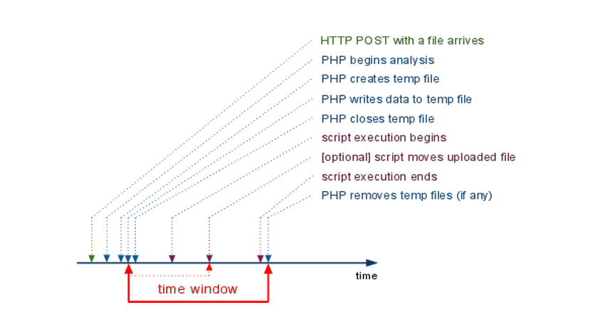

## Temporary file  && session files
Chủ yếu là dựa vào race condition

### `PHP_SESSION_UPLOAD_PROGRESS` trick [chi tiết](https://hacktricks.wiki/en/pentesting-web/file-inclusion/via-php_session_upload_progress.html)
- Tính năng upload file của PHP có thể tạo `session file` ngay cả khi có cấu hình `session.auto_start=Off`. 
- yêu cầu: `session.upload_progress.enabled=On` , nếu dòng này bị comment ở `php.ini` thì vẫn  hoạt động.

```
$ curl http://127.0.0.1/ -H 'Cookie: PHPSESSID=iamorange' -F 'PHP_SESSION_UPLOAD_PROGRESS=blahblahblah'  -F 'file=@/etc/passwd'
```
request bắt ở burp:
```
POST /index.php HTTP/1.1
Host: vulnerable-target.com
Cookie: PHPSESSID=iamorange
Content-Type: multipart/form-data; boundary=----------------boundary123
Content-Length: 350

----------------boundary123
Content-Disposition: form-data; name="PHP_SESSION_UPLOAD_PROGRESS"

blahblahblah
----------------boundary123
Content-Disposition: form-data; name="file"; filename="test.txt"
Content-Type: text/plain

A
----------------boundary123--
```

khi có name= `PHP_SESSION_UPLOAD_PROGRESS` thì sẽ có 1 `iamorange` session file tạo ở `/var/lib/php/sessions/` có nội dung như sau: `upload_progress_blahblahblah` với `blahblahblah` là bị controll bởi user. File này sẽ bị xóa khi kết thúc vòng đời của request.

### RCE via PHPInfo [chi tiết](https://hacktricks.wiki/en/pentesting-web/file-inclusion/lfi2rce-via-phpinfo.html)
- file `/phpinfo.php` lưu các thông tin hưu ích như php version , php variable,....
- khi upload 1 file thì php sẽ tạo 1 file `phpXXXXXX` , `XXXXXX` thuộc [A-Za-z0-9] , lưu nội dung của file được upload lên ở `upload_tmp_di` mặc định là `/tmp`. File tạm này sẽ bị xóa khi vòng đời của request kết thúc.
- When output from a PHP script is larger than the output buffer setting, partial content is returned to the requestor using chunked transfer encoding.`PHP output buffer` mặc định khoảng `4096` bytes. Nếu một request gửi lên quá mới thì sẽ làm tràn `buffter` gây ra một phần nội dung response được trả về trước khi kết thuc vòng đời của request.Ở response thì đọc theo `chunked` để đọc trước nội dung của một só resonse . 

### `compress.zlib://` and `PHP_STREAM_PREFER_STDIO` [Chi tiết](https://github.com/b4rdia/HackTricks/blob/master/pentesting-web/file-inclusion/lfi2rce-via-compress.zlib-%2B-php_stream_prefer_studio-%2B-path-disclosure.md)
- Yêu cầu: `allow_url_fopen = On`
- 1 file tạm sẽ được tạo ở `/tmp` nội dung file tạm bị controll bởi http response của URL nhập vào.

### Log Poisoning[chi tiết](https://www.exploit-db.com/papers/12886)
`proc/self/environ` , `/var/lib/php/sessions/` , `var/log/apache2/` , `/proc/self/fd/`
- On Linux systems, `/proc/self/environ` contains the environment variables of the current process — including web server processes like Apache or Nginx running PHP.
- Nội dung của `User-Agent` header được lưu vào file này.

### Nginx Assistance 
[chi tiết 1](https://bierbaumer.net/security/php-lfi-with-nginx-assistance/) 

[chi tiết 2](https://hacktricks.wiki/en/pentesting-web/file-inclusion/lfi2rce-via-nginx-temp-files.html)

[chi tiết 3](https://guylewin.com/blog/2021-12-27-winning-the-impossible-race-an-unintended-solution-for-includers-revenge-counter-hxp-2021/)
- Default Nginx  cung cấp tính năng [client body buffering](https://nginx.org/en/docs/http/ngx_http_core_module.html#variables_hash_max_size) , nếu vượt quá body request vượt qua thông số `client_body_buffer_size` thì Nginx sẽ tự động ghi phần dữ liệu vượt mức đó ra các file tạm (temporary files) trên ổ đĩa thay vì giữ toàn bộ trong bộ nhớ RAM.File tạm này lưu ở (defaults to `/tmp/nginx/client-body` or `/var/lib/nginx/body`). 
- file tạm nãy sẽ bị xóa ngay sau khi mở file descriptor , File chỉ tồn tại trong khoảng thời gian giữa `open()` và `unlink()` 
```
fd = open((const char *) name, O_CREAT|O_EXCL|O_RDWR, access ? access : 0600);
if (fd != -1 && !persistent) {
    (void) unlink((const char *) name);
}
```
- Một cơ chế mặc định trong kernel linux:
    - Nếu một file bị xóa trong khi process vẫn đang giữ một file descriptor (`fd`) đang mở và fd đó được hiển thị trong `/proc/<pid>/fd/`. Hiểu đơn giản File bị xóa nhưng process vẫn giữ fd → `/proc/<pid>/fd/<n>` vẫn tồn tại. thì sẽ có 2 hành vi sau:
        - `realpath()` will return the last path of the file with " (deleted)" appended to it.
        - `open()` will return an fd that can be used to read the original file content.
    
- Câu hỏi đặt ra là làm sao giữ vòng đời của `fd` lâu nhất có thể? Vòng đời của fd gắn chặt với vòng đời của request — `fd` sinh ra khi request bắt đầu được xử lý và chết đi khi request kết thúc (hoặc bị hủy).
- Sử dụng socket để gửi raw request , gửi theo từng chunked byte để kéo dài request.


### LFI2RCE via Eternal waiting [chi tiết](https://hacktricks.wiki/en/pentesting-web/file-inclusion/lfi2rce-via-eternal-waiting.html#lfi2rce-via-eternal-waiting)
Yêu cầu: có LFI thì làm cho be include file `/sys/kernel/security/apparmor/revision` nó sẽ làm cho  PHP include never end. Trong lúc này upload file độc hại.
```
POST /vulnerable.php?file=/sys/kernel/security/apparmor/revision HTTP/1.1
Host: target.com
Content-Type: multipart/form-data; boundary=----X

------X
Content-Disposition: form-data; name="file1"; filename="shell.php"
Content-Type: application/x-php
```