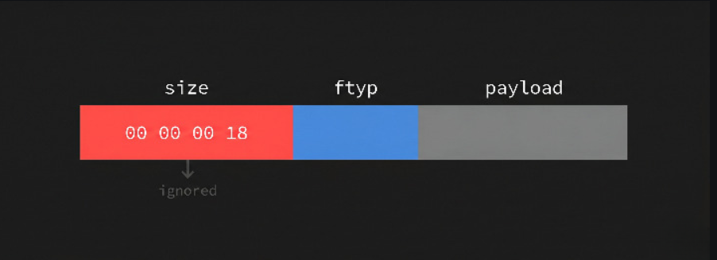
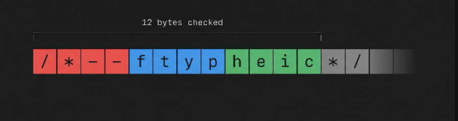

## 1. Giải Mã Tệp Polyglot [chi tiết](https://blog.voorivex.team/usual-suspect-type-confusion-in-twelve-bytes)

What are polyglots? [chi tiết](https://medium.com/swlh/polyglot-files-a-hackers-best-friend-850bf812dd8a)
- Polyglots, in a security context, are files that are a valid form of multiple different file types.For example, a GIFAR is both a GIF and a RAR file. There are also files out there that can be both GIF and JS, both PPT and JS, etc.
- Polyglot files are often used to bypass protection based on file types. Many applications that allow users to upload files only allow uploads of certain types, such as JPEG, GIF, DOC, so as to prevent users from uploading potentially dangerous files like JS files, PHP files or Phar files.

what is ISO Base Media File Format?
- Là một standard format cho các file phương tiện (media) như MP4, MOV, HEIC, AVIF, … Định dạng của nó có thể hiểu là các box tuần tự: Every box begins with a 4-byte size, a 4-byte type, and then its payload:


thư viện file-type of node version 16.5.4
```
// File Type Box (ISO base media file format)
if (
    checkString('ftyp', {offset: 4}) &&// kiểm tra từ byte thứ 4 , check type of box
    (buffer[8] & 0x60) !== 0x00 // Brand major, first character ASCII?
) {
    const brandMajor = buffer.toString('binary', 8, 12).replace('\0', ' ').trim();
    switch (brandMajor) {
        case 'avif':              return {ext: 'avif', mime: 'image/avif'};
        case 'mif1':              return {ext: 'heic', mime: 'image/heif'};
        case 'heic': case 'heix': return {ext: 'heic', mime: 'image/heic'};
        // ...
    }
}
```
đoạn code trên bỏ qua hoàn toàn các byte 0->3 . Box size hoàn toàn bị bỏ qua


Ý tưởng:
- chèn kí tự commnet vào phần size box và payload box. Đặc biệt nguy hiểm khi xả ra case phía BE sử dụng kiểm tra loại file sơ sài (Shallow Sniffing) nhưng khi trả ngược lại về người dùng thì lại set content-type dựa vào extension. 

### ý nghĩa:
- type file không phải là tĩnh mà nó được định nghĩa
- Các thư viện quét nhanh như file-type ra đời để tối ưu hiệu năng (chỉ đọc vài byte đầu để đoán định dạng), hoàn toàn không phải là bộ phân tích cấu trúc tệp (parser) chuyên sâu. Dùng chúng như lớp phòng thủ cốt lõi để quyết định tệp có an toàn hay không là một sai lầm chết người.
